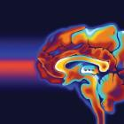
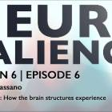
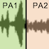
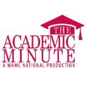
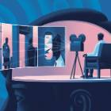
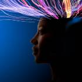
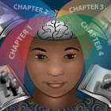
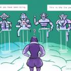
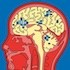
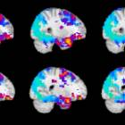

## Media Coverage

<table>
<tr>
<td style="width:410px"><i>"Why Do Places Bring Old Memories Flooding Back?"</i> AM 1150 Bianca's Bizarre, October 9, 2026.
 <a href="https://www.am1150.ca/podcast/biancas-bizarre-why-do-places-bring-old-memories-flooding-back/">[interview link]</a>
</td>
<td style="width:70px"></td>
</tr>
</table>

<table>
<tr>
<td style="width:70px"></td>
<td style="width:410px"><i>"Why your brain turns life into stories."</i> Scientific American, August 18, 2026.
 <a href="https://www.scientificamerican.com/article/the-brain-doesnt-just-experience-reality-it-edits-it-into-a-story/">[article link]</a>
</td>
</tr>
</table>

<table>
<tr>
<td style="width:410px"><i>"Event scripts: How the brain structures experience."</i> OHBM Neurosalience podcast, January 22, 2026.
 <a href="https://www.youtube.com/watch?v=72reF48sWEc">[podcast link]</a>
</td>
<td style="width:70px"></td>
</tr>
</table>

<table>
<tr>
<td style="width:70px"></td>
<td style="width:410px"><i>"Your Brain Knows Which Locations Will Make Memories Stick — Even Before Anything Happens There."</i> The Debrief, January 16, 2026.
 <a href="https://thedebrief.org/your-brain-knows-which-locations-will-make-memories-stick-even-before-anything-happens-there/">[article link]</a>
</td>
</tr>
</table>

<table>
<tr>
<td style="width:410px"><i>"Ever Feel Like Other Fans Are Wrong on the Internet?"</i> Psychology Today, July 6, 2025.
 <a href="https://www.psychologytoday.com/us/blog/the-science-of-fandom/202507/ever-feel-like-other-fans-are-wrong-on-the-internet">[article link]</a>
</td>
<td style="width:70px"></td>
</tr>
</table>

<table>
<tr>
<td style="width:70px"></td>
<td style="width:410px"><i>"Music used to study how we shift between emotions."</i> Cosmos Magazine, July 1, 2025.
 <a href="https://connectsci.au/news/news-parent/6677/Music-used-to-study-how-we-shift-between-emotions">[article link]</a>
</td>
</tr>
</table>

<table>
<tr>
<td style="width:410px"><i>"Art's Influence on the Brain Better Understood: New Data."</i> Medscape, July 1, 2025.
 <a href="https://www.medscape.com/viewarticle/arts-influence-brain-better-understood-new-data-2025a1000hit">[article link]</a>
</td>
<td style="width:70px"></td>
</tr>
</table>

<table>
<tr>
<td style="width:70px"></td>
<td style="width:410px"><i>"The Brain Organizes Narratives Into Meaningful Event Memories."</i> The Academic Minute, June 4, 2025.
 <a href="https://www.academicminute.org/p/best-of-the-academic-minute-in-2025-339">[interview link]</a>
</td>
</tr>
</table>

<table>
<tr>
<td style="width:410px"><i>"How 'Event Scripts' Structure Our Personal Memories."</i> Quanta Magazine, February 21, 2025.
 <a href="https://www.quantamagazine.org/how-event-scripts-structure-our-personal-memories-20250221/">[article link]</a>
</td>
<td style="width:70px"></td>
</tr>
</table>

<table>
<tr>
<td style="width:70px"></td>
<td style="width:410px"><i>"Study reveals how the brain divides days into 'movie scenes'."</i> Live Science, October 9, 2024.
 <a href="https://www.livescience.com/health/memory/study-reveals-how-the-brain-divides-days-into-movie-scenes">[article link]</a>
</td>
</tr>
</table>

<table>
<tr>
<td style="width:410px"><i>"Our Brains Divide the Day Into Chapters. New Psychology Research Offers Details on How."</i> Columbia News, October 3, 2024.
 <a href="https://news.columbia.edu/news/our-brains-divide-day-chapters-new-psychology-research-offers-details-how">[article link]</a>
</td>
<td style="width:70px"></td>
</tr>
</table>

<table>
<tr>
<td style="width:70px"></td>
<td style="width:410px"><i>"Verbal Nonsense Reveals Limitations of AI Chatbots."</i> Zuckerman Institute News, September 14, 2023.
 <a href="https://zuckermaninstitute.columbia.edu/verbal-nonsense-reveals-limitations-ai-chatbots">[article link]</a>
</td>
</tr>
</table>

<table>
<tr>
<td style="width:410px"><i>"The Science of Mind Reading."</i> The New Yorker, December 6, 2021.
 <a href="https://www.newyorker.com/magazine/2021/12/06/the-science-of-mind-reading">[article link]</a>
</td>
<td style="width:70px"></td>
</tr>
</table>

<table>
<tr>
<td style="width:70px"></td>
<td style="width:410px"><i>"Several brain regions help us anticipate what's going to happen next."</i> PNAS Journal Club, April 30, 2021.
 <a href="https://www.pnas.org/post/journal-club/several-brain-regions-help-us-anticipate-whats-going-to-happen-next">[article link]</a>
</td>
</tr>
</table>

<table>
<tr>
<td style="width:410px"><i>"Building Memories in the Brain."</i> TEDxCarnegieLake talk, October 28, 2017.
 <a href="https://www.youtube.com/watch?v=D-aPGXXIYZc">[video link]</a>
</td>
<td style="width:70px"></td>
</tr>
</table>
