<table style="width:100%">
<tr>
<td style="width:280px"><b>Chris Baldassano:</b> Chris got his PhD in Computer Science at Stanford (using machine learning methods to study the human visual system) before becoming a postdoc at the Princeton Neuroscience Institute and then an Assistant Professor in the Columbia Psychology Department.
 <a href="http://chrisbaldassano.com/">Personal Website</a>
 <a href="http://blog.chrisbaldassano.com/">Personal Blog</a>
 
</td>
<td style="width:200px">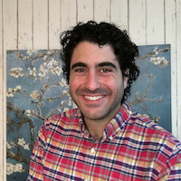</td>
</tr>
</table>

## Postdocs
<table style="width:100%">
<tr>
<td style="width:280px"><b>Matthew Sachs</b> (Presidential Scholars in Society and Neuroscience program): Matt received his PhD from the University of Southern California’s in Dr. Antonio Damasio's Brain and Creativity Institute. His research focuses on modeling the neural and behavioral mechanisms involved in emotional and rewarding responses to naturalistic stimuli, such as music and film. 
 <a href="http://www.matthewsachs.com/">Personal Website</a>
 
</td>
  <td style="width:200px">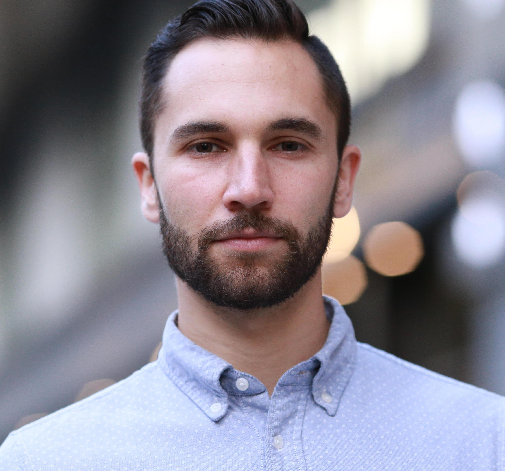</td>
</tr>
</table>

<table style="width:100%">
<tr>
<td style="width:200px">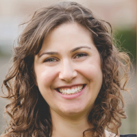</td>
<td style="width:280px"><b>Halle Dimsdale-Zucker</b>: Halle completed her PhD in cognitive neuroscience at UC Davis before joining the DPM and Aly labs as a postdoc. She has been studying memory since her freshman year of college (and yet still struggles to remember peoples' names).
 <a href="https://hallezucker.com/">Personal Website</a>
 
</td>
</tr>
</table>

<table style="width:100%">
<tr>
<td style="width:280px"><b>Samantha Cohen</b>: Samantha completed a PhD in Psychology in the lab of Dr. Lucas Parra at The City University of New York. During her time there, she used EEG responses to dynamic naturalistic videos to better understand the modulation of attention and memory.
 <a href="https://www.parralab.org/people/samantha/">Personal Website</a>
 
</td>
<td style="width:200px">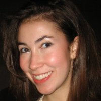</td>
</tr>
</table>

## PhD Students
<table style="width:100%">
<tr>
<td style="width:200px">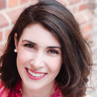</td>
<td style="width:280px"><b>Hannah Tarder-Stoll</b>: Before starting at Columbia, Hannah received an Honours BSc from the University of Toronto in 2018 with a double major in psychology and neuroscience. She is interested in the modulation of episodic memory and how the hippocampus interacts with prefrontal regions to integrate new information into previous memory stores.
 
</td>
</tr>
</table>

<table style="width:100%">
<tr>
<td style="width:280px"><b>Matt Siegelman</b>: Matt grew up outside Philadelphia and got his undergraduate degree in Neuroscience from Wesleyan in 2016. He worked as an RA in a language lab at MIT before joining the DPM lab at Columbia, where he hopes to apply AI, natural language processing tools and naturalistic stimuli to study concept representations in memory. 
 
</td>
<td style="width:200px">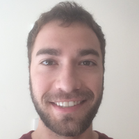</td>
</tr>
</table>

<table style="width:100%">
<tr>
<td style="width:200px"></td>
<td style="width:280px"><b>Jiawen Huang</b>: After finishing from UCL’s BSc Psychology program, Jiawen stayed at UCL as a RA to build a database of people watching movies in fMRI. He is interested in how memory works in context, such as during movie viewing. He also hopes to explore methods to study memory with more complex tasks such as interactive games. 
 
</td>
</tr>
</table>

## Lab manager
<table style="width:100%">
<tr>
<td style="width:280px"><b>Alexandra Reblando</b>: Alex enjoys contemplating the forms of schemas: their creation, machinations, and interaction with perception and memory. In repose, she works on expanding her own schemas particularly those of art museums, restaurants, and dingy music venues.
 
</td>
<td style="width:200px">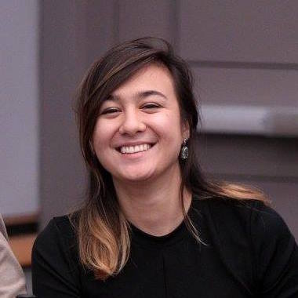</td>
</tr>
</table>

## Undergraduate honors students
<table style="width:100%">
<tr>
  <td style="width:200px">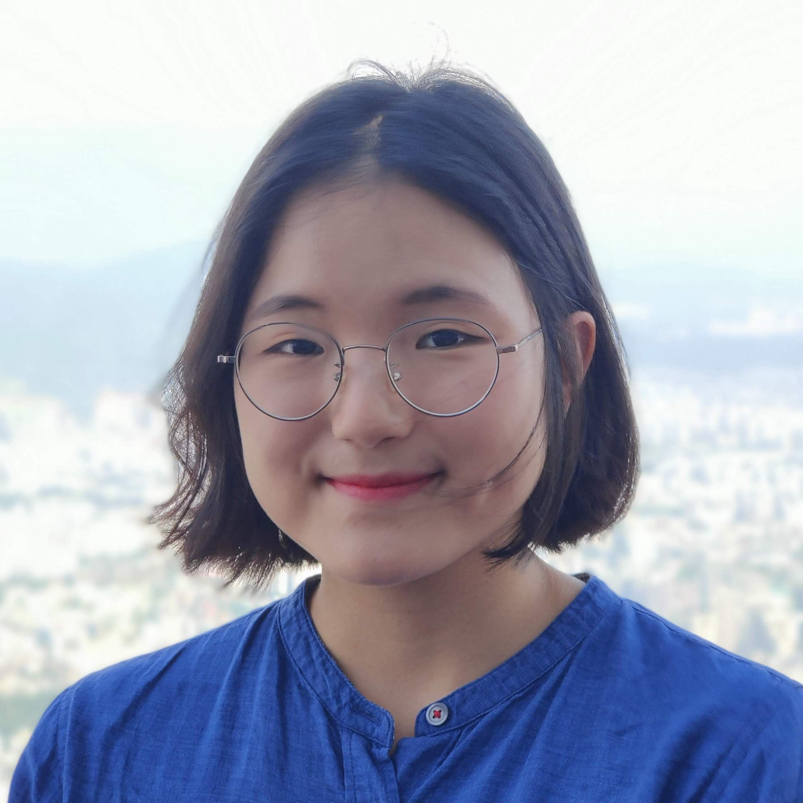</td>
<td style="width:280px"><b>Sunjae Shim</b>: Sunjae is an undergraduate student at Columbia University studying psychology. She is interested in combining her interests in psychology and film studies to look into how people perceive naturalistic stimuli. Outside of school work, she likes binge watching TV shows with her hamster, Tiramisu.
 
</td>
</tr>
</table>

<table style="width:100%">
<tr>
<td style="width:280px"><b>Mareike Keller</b>: Mareike is an undergraduate student at Columbia studying Psychology and Computer Science. She is interested in how humans process novel situations and the impact that past experiences have on their predictions. In the future, she hopes to work in the field of human-computer interaction. Outside of the lab, Mareike enjoys discovering new music, running, and cats.
 
</td>
<td style="width:200px">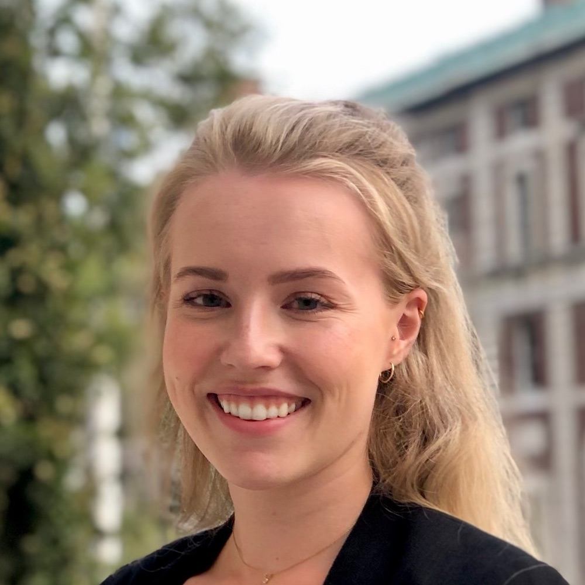</td>
</tr>
</table>

## Research Assistants
<table style="width:100%">
<tr> 
<td style="width:280px"><b>Max Bennett</b>: After finishing his undergrad at Tufts University in Cognitive Brain Science and Computer Science, Max worked for a few years at a robotics company before joining Columbia for an MS in Computer Science. He is interested in how computational models, such as neural networks, compare and contrast to the brain.
 
</td>
<td style="width:200px">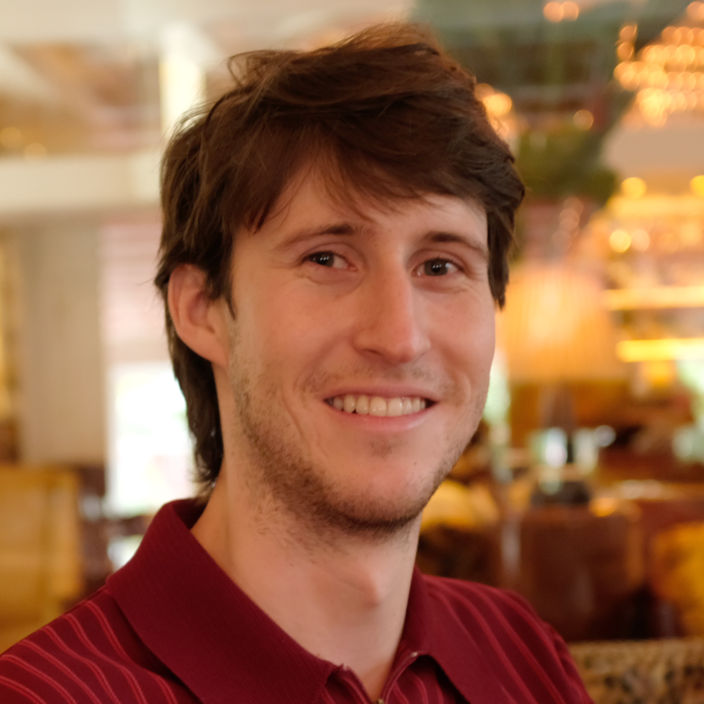</td>
</tr>
</table>

<table style="width:100%">
<tr>
<td style="width:200px">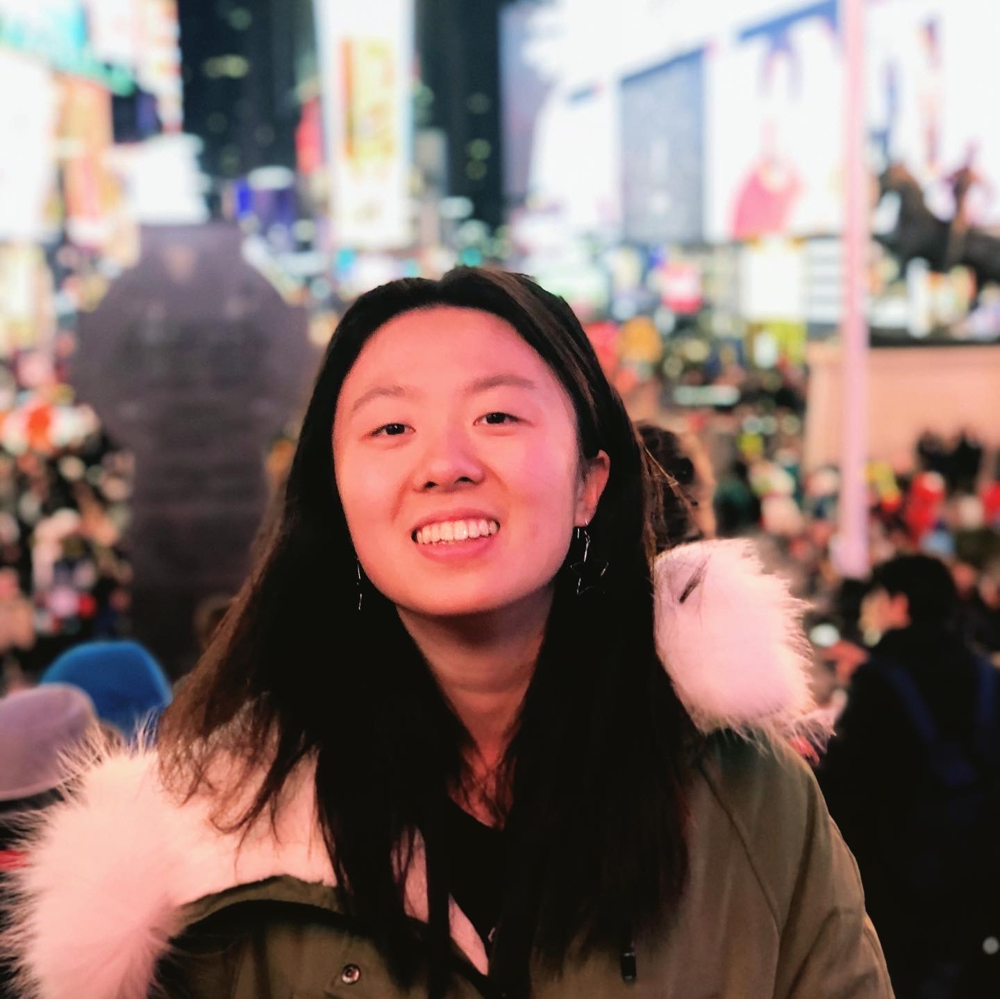</td>
<td style="width:280px"><b>Cindy Gao</b>: Cindy is a rising sophomore at Columbia College who is interested in psychology and behavioral economics. She is curious about the neural mechanisms behind decision making. In her free time, she enjoys playing classical piano, skiing, and watching Broadway shows. 
 
</td>
</tr>
</table>

<table style="width:100%">
<tr>
<td style="width:280px"><b>Franck Mugisho</b>: Franck is a rising sophomore at Columbia University pursuing a Bachelor’s degree in Computer Science. He enjoys reading about the brain and psychology in general and is interested in designing computer software that will shed light on how the brain processes information. Franck’s hobbies include watching soccer games, biking, running, and spending time with family and friends.
 
</td>
<td style="width:200px">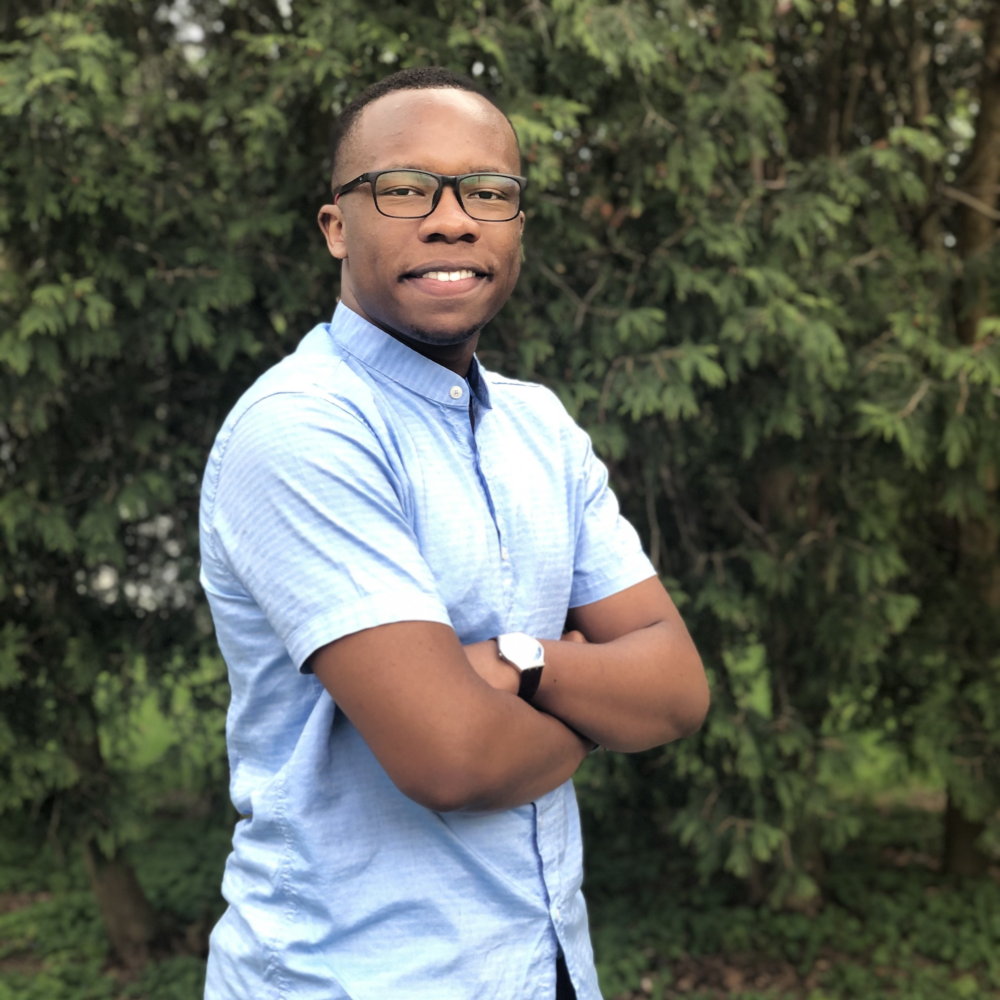</td>
</tr>
</table>

<table style="width:100%">
<tr>
<td style="width:200px">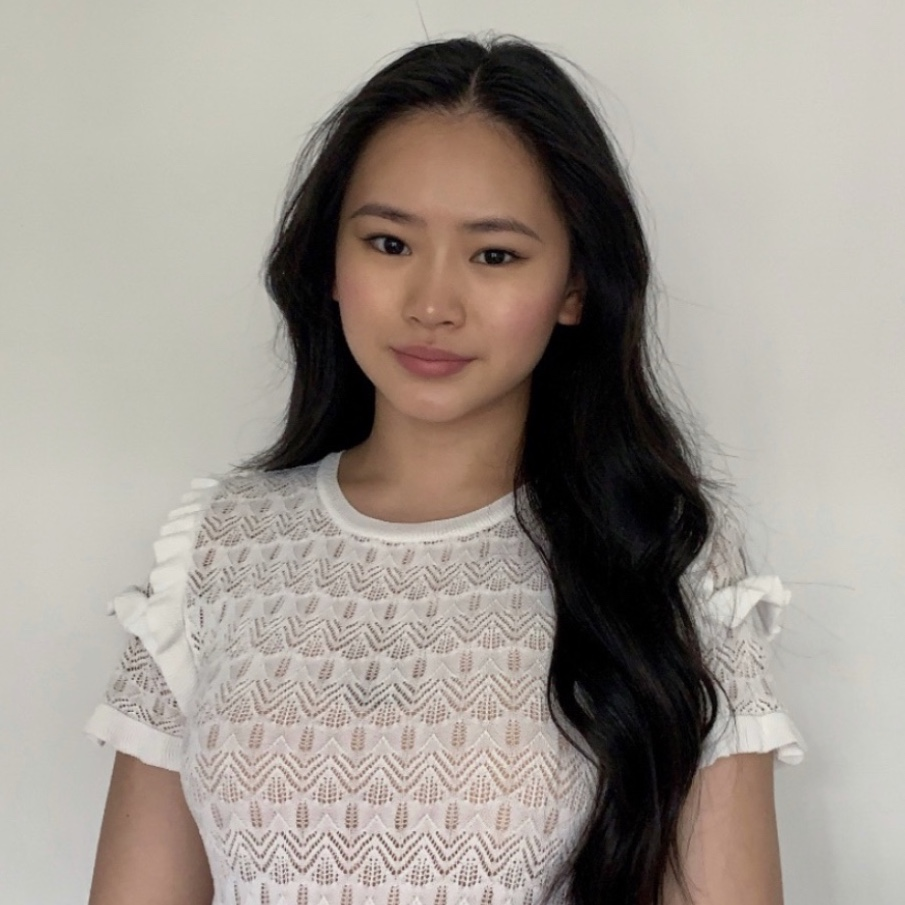</td>
<td style="width:280px"><b>Elen Zhu</b>: Elen is a sophomore at Columbia College pursuing a Bachelor’s degree in Neuroscience and Behavior. She is interested in the mechanisms in play between perception and memory. In her free time, she enjoys sewing, crocheting, attempting to paint and spending time with friends and family.
 
</td>
</tr>
</table>

<table style="width:100%">
<tr>
<td style="width:280px"><b>Ezgi Oztelcan</b>: Ezgi is a third-year UC Berkeley psychology student from Istanbul, Turkey, aiming to further develop her scientific approach skills and practice in different specializations in psychology to support shaping future academic and career goals. She is eager to learn new ways to continuously improve herself academically, professionally, and socially. She is interested in how evolutionary developmental processes affect the human brain on a neurological basis, with an emphasis on language development! In her free time, she enjoys petsitting for her friends, skiing, and playing around with analog cameras.
 
</td>
<td style="width:200px">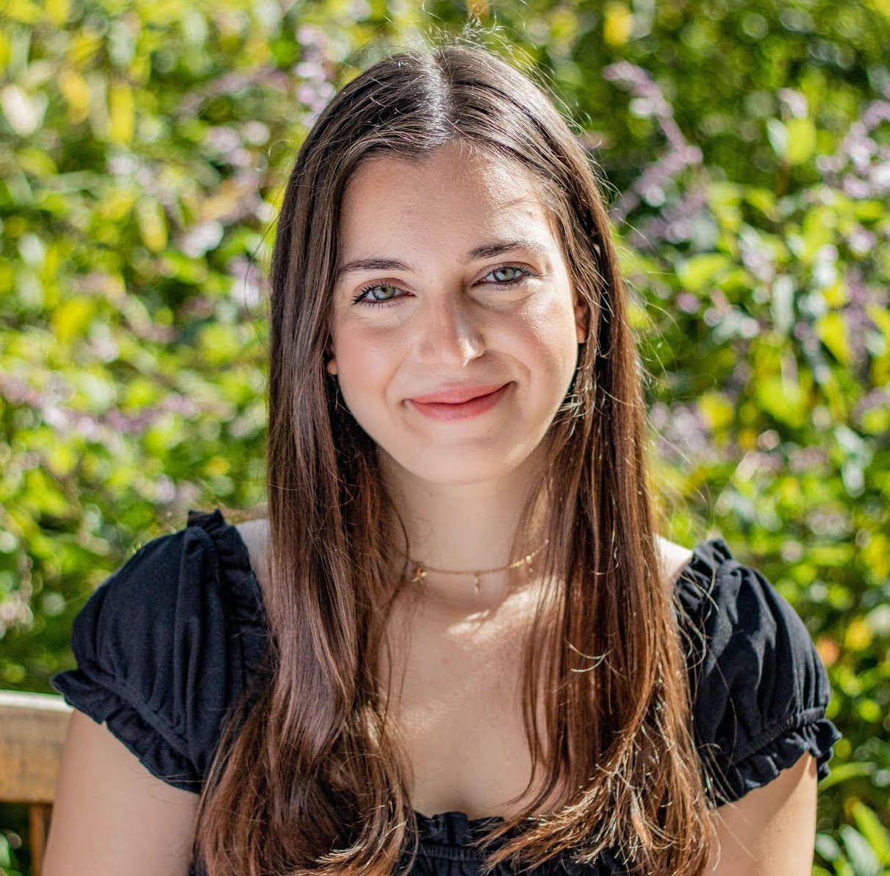</td>
</tr>
</table>

<table style="width:100%">
<tr>
<td style="width:200px">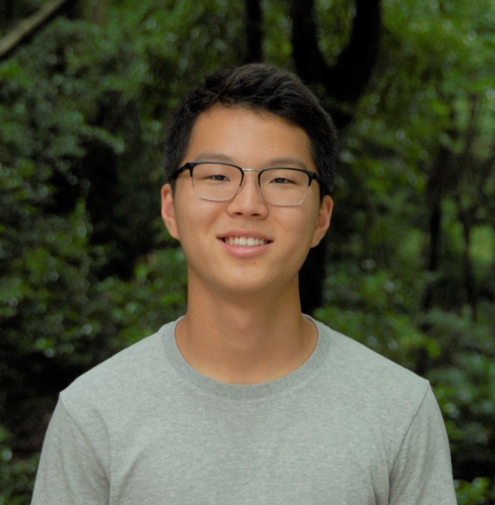</td>
<td style="width:280px"><b>Tony Kim</b>: Tony is an undergraduate student at Columbia studying neuroscience and philosophy. He is interested in how episodic and semantic schemas affect information processing and stimuli interpretation. In his free time, he enjoys reading, watching basketball, and walking his dog.
 
</td>
</tr>
</table>

<table style="width:100%">
<tr>
<td style="width:280px"><b>Jason Wang</b>: Jason Wang is a junior in Columbia College who values curiosity and creativity above all else. As a Neuroscience student on the premed track as well as a violinist, he is always on the lookout for new possibilities to fuse artistic mindfulness with psychiatric methods. Over the summer of 2019, he worked as an artist and curator in the Athens Curatorial Project, where he created an audio installation that explored the prevalence and impact of cultural clichés on the Greek collective unconscious.
 
</td>
<td style="width:200px">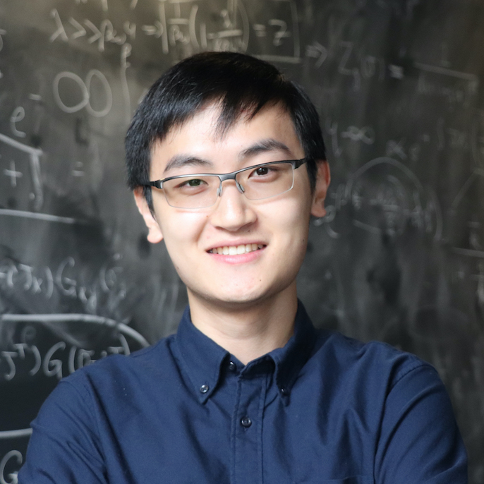</td>
</tr>
</table>

<table style="width:100%">
<tr>
<td style="width:200px"></td>
<td style="width:280px"><b>Sophie Blitsman</b>: Sophie is a senior at Great Neck South High School looking to apply to colleges with a major in general psychology. She hopes to later narrow her major down to experimental psychology. Sophie has been enrolled in her high school’s research program for 4 years that has allowed her to pursue her interest in researching human behavior.
 
</td>
</tr>
</table>

<table style="width:100%">
<tr>
<td style="width:280px"><b>Ally Lin</b>: Ally is a sophomore undergraduate studying Political Science and Psychology at Columbia. She is interested in combining her two majors in the study of political psychology, and is fascinated by the world of neuropsychology. When she's not frantically working on academic work, she enjoys writing poetry and creating visual art with watercolor and occasionally ink and water.
 
</td>
<td style="width:200px">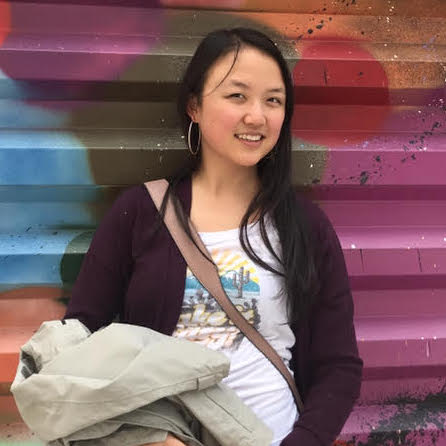</td>
</tr>
</table>

<table style="width:100%">
<tr>
<td style="width:200px">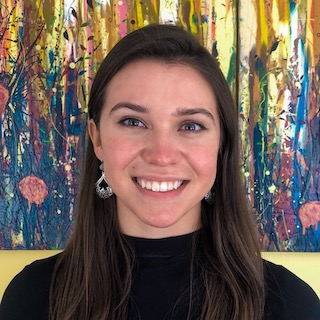</td>
<td style="width:280px"><b>Zion Walker</b>: Zion is an undergraduate student at Columbia studying neuroscience and behavior. She is interested in the formation and retrieval of episodic memories as well as the impact of neurological impairments like dementia on memory.  In her free time, she enjoys dancing ballet, hiking, kayaking, and creating portraits with charcoal or acryllics.
 
</td>
</tr>
</table>

## Former Lab Members
<table style="width:100%">
<tr>
<td style="width:200px">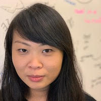</td>
<td style="width:280px"><b>Caroline Lee</b>, Volunteer research assistant: Caroline finished her MS in Computer Science at NYU's Courant Institute in 2017. She is interested in how the brain organizes and represents semantic structure and the use of machine-learning based joint-modeling approaches to explain the dynamics of brain and behavior. Her spare time is spent debugging TensorFlow code in Pat Shafto’s lab and attempting to play classical guitar.
 
</td>
</tr>
</table>

<table style="width:100%">
<tr>
<td style="width:280px"><b>Labeebah Subair</b>, Summer research assistant: Labeebah is a rising sophomore at Yale University who hopes to pursue her undergraduate degree in psychology and neuroscience. She is interested in how the brain processes psychological trauma, formulates memories, and promotes habitual neural activity. This interest is rooted in her passion for social justice and hope to relate concepts of trauma to identity and discrimination. 
 
</td>
<td style="width:200px">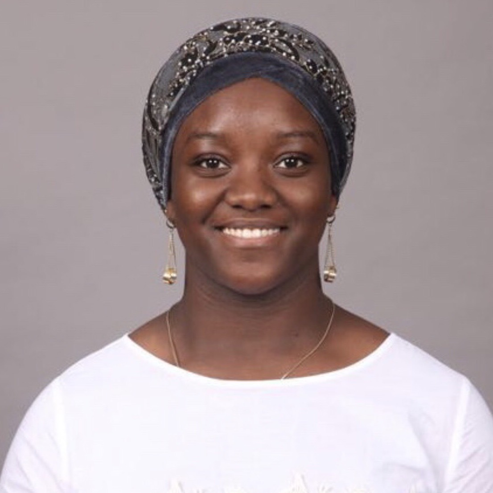</td>
</tr>
</table>

<table style="width:100%">
<tr>
<td style="width:200px">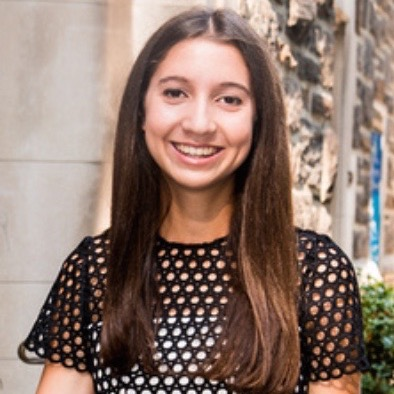</td>
<td style="width:280px"><b>Sophia Africk</b>, Summer intern: Sophia is a senior at Trinity School in New York City, where she is interested in math and psychology.  In her free time, she enjoys trying new restaurants around the city.
 
</td>
</tr>
</table>
