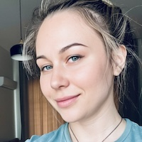
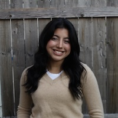
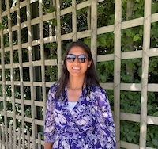
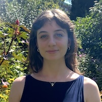
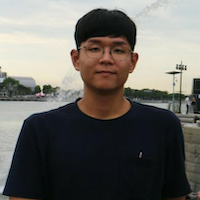
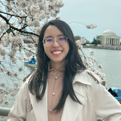
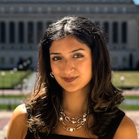
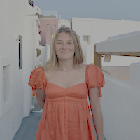

<table style="width:100%">
<tr>
<td style="width:280px"><b>Chris Baldassano:</b> Chris got his PhD in Computer Science at Stanford (using machine learning methods to study the human visual system) before becoming a postdoc at the Princeton Neuroscience Institute and then an Assistant Professor in the Columbia Psychology Department.
 <a href="http://chrisbaldassano.com/">Personal Website</a>
 <a href="http://blog.chrisbaldassano.com/">Personal Blog</a>
 
</td>
<td style="width:200px"></td>
</tr>
</table>

## Postdocs
<table style="width:100%">
<tr>
<td style="width:200px"></td>
<td style="width:280px"><b>Marta Silva</b>: After finishing her Integrated BSE/MSE in Biomedical and Biophysical Engineering, Marta joined the University of Barcelona for her doctoral students which were completed in 2023. In her work she focuses on breaking new ground on how memories from one's past get represented in the brain by tracking, prospectively, essential electrophysiology properties for everyone’s real-life episodic event experience.
 
</td>
</tr>
</table>

## PhD Students
<table style="width:100%">
<tr>
<td style="width:200px"></td>
<td style="width:280px"><b>Jiawen Huang</b>: After finishing UCL’s BSc Psychology program, Jiawen stayed at UCL as a RA to build a database of people watching movies in fMRI. He is interested in how memory works in context, such as during movie viewing. He also hopes to explore methods to study memory with more complex tasks such as interactive games. 
 
</td>
</tr>
</table>

<table style="width:100%">
<tr>
<td style="width:280px"><b>Taylor Chamberlain</b>: After finishing her BA at University of Chicago, Taylor worked as a software developer, and then returned to UChicago to work as a lab manager in the psychology department. She's interested in using fMRI and behavioral experiments to study how memory and attention interact, particularly in more naturalistic task paradigms. 
 
</td>
<td style="width:200px"></td>
</tr>
</table>

<table style="width:100%">
<tr>
<td style="width:200px"></td>
<td style="width:280px"><b>Caroline Lee</b>: Caroline finished her MS in Computer Science at NYU's Courant Institute in 2017. She is interested in how the brain organizes and represents semantic structure and the use of machine-learning based joint-modeling approaches to explain the dynamics of brain and behavior. Her spare time is spent debugging TensorFlow code and attempting to play classical guitar.
 
</td>
</tr>
</table>

<table style="width:100%">
<tr>
<td style="width:280px"><b>Zall Hirschstein</b>: After graduating from Bard College as an advisee of Dr. Justin Hulbert, Zall spent two years at Albany Medical College doing neuropathology research and three years as the Aly Lab manager here at Columbia. He now joins both the DPM and Aly Labs as a graduate student to investigate how our memory systems coordinate with the rest of the brain to support the demands of attention and perception.
 
</td>
<td style="width:200px"></td>
</tr>
</table>

## Undergraduate RAs and Thesis students
<table style="width:100%">
<tr>
<td style="width:200px"></td>
<td style="width:280px"><b>Gabriella Calabia</b>: Gabriella is an I.I. Rabi Research Scholar at Columbia College studying Cognitive Science and English literature. She investigates memory, time, and the conceptualization of narratives through the intersection of neuroscience and film. Gabriella is also an editor on <i>The Gadfly</i>, Columbia’s philosophy magazine, and vice president of the Columbia Undergrad Sketch Show. Outside of the lab, she loves hiking, skiing, and painting.
 
</td>
</tr>
</table>

<table style="width:100%">
<tr>
<td style="width:280px"><b>Caroline (Dana) Lauren Villamin</b>: Caroline is a Class of ’27 undergraduate at Barnard College studying Cognitive Science. She is interested in applying her background in linguistics to research how memory is organized in the brain in relation to language processing. In her free time she likes to play guitar, explore the city, and collect vintage postcards.
 
</td>
<td style="width:200px"></td>
</tr>
</table>

<table style="width:100%">
<tr>
<td style="width:200px"></td>
<td style="width:280px"><b>Mariya Curry (Nataliia Viktorchuk)</b>: Mariya is a senior psychology major at Columbia University, completing her STAR Honors thesis on pupillometry and narrative processing. Her research studies how pupil responses at story boundaries reveal different types of expectations, testing whether individual cognitive filters show measurable differences. She is also pursuing a PhD in Educational and Pedagogical Sciences in Ukraine, and with a background in filmmaking, entrepreneurship, and analytical psychology, she integrates creative practice and scientific research to develop cross-cultural models of education and resilience.
 
</td>
</tr>
</table>

<table style="width:100%">
<tr>
<td style="width:280px"><b>Erika Gonzalez</b>: Erika is a class of ‘26 pre-medical student at Columbia College studying Neuroscience and Behavior. Her research interests lie in mentalizing networks. For her senior thesis, she will investigate the possibility of cross-modal synchrony in event boundaries to develop a model for studying multi-sensory deficits in clinical populations. In her free time, she enjoys exploring the city, dancing, and hiking.
 
</td>
<td style="width:200px"></td>
</tr>
</table>

<table style="width:100%">
<tr>
<td style="width:200px"></td>
<td style="width:280px"><b>Sareena Parikh</b>: Sareena is a senior at Barnard College studying Cognitive Science with a concentration in AI. She is eager to learn about how competition and cooperation impact memory and look at the long-term impact it has on a typical classroom learning environment. In her free time, she enjoys reading, playing sports, and spending time with friends.
</td>
</tr>
</table>

<table style="width:100%">
<tr>
<td style="width:280px"><b>Leandra Quick</b>: Leandra is a class of ‘26 undergraduate at Barnard College studying Psychology and Art History. She is interested in the perception and expression of art, hoping to study and learn more about the individual self and how imagination, mannerisms, and thought patterns impact memory. In her free time, she enjoys going to museums, taking long walks with friends, and listening to music.
 
</td>
<td style="width:200px"></td>
</tr>
</table>

<table style="width:100%">
<tr>
<td style="width:200px"></td>
<td style="width:280px"><b>KyungHwan Chee</b>: Kyunghwan is a postbacc student at Columbia University studying psychology. He is interested in learning about memory and time, especially understanding the components of memory. In his free time, he enjoys running and exploring the city.
 
</td>
</tr>
</table>

<table style="width:100%">
<tr>
<td style="width:280px"><b>Xinran Liu</b>: Xinran is a post-baccalaureate student at Columbia University pursuing a psychology certificate. She is interested in how music features are represented in the brain and how music shapes cognitive processes. In her free time, she enjoys playing the piano, singing, and writing fanfiction.
 
</td>
<td style="width:200px"></td>
</tr>
</table>

<table style="width:100%">
<tr>
<td style="width:200px"></td>
<td style="width:280px"><b>Sudheshna Khadka</b>: Sudheshna is a senior at Barnard studying Cognitive Science. Her thesis will center on the intersections of film, music, and cognition, with a particular focus on how people experience time and narrative. Around campus, she serves as the Technical Coordinator for King’s Crown Shakespeare Troupe, is an active member of AOII, and a committee chair for Barnard’s New Student Orientation Program. Beyond the academic environment, she can be found enjoying films, roller-skating, or spending time with her friends.
 
</td>
</tr>
</table>

<table style="width:100%">
<tr>
<td style="width:280px"><b>Paulina Bertilsson</b>: Paulina is a senior at Barnard College majoring in Neuroscience, where her research explores how the brain processes language and memory. She also brings experience from venture capital, where she analyzed biotech and AI companies at the intersection of science and business strategy. Outside of academics, Paulina enjoys running, cooking, and building intricate Lego sets.
 
</td>
<td style="width:200px"></td>
</tr>
</table>

## Former Lab Members
<b>Postdocs</b>
* <a href="https://hallezucker.com/">Halle Dimsdale-Zucker</a>
* <a href="https://sites.google.com/view/samanthacohen/home">Samantha Cohen</a>
* <a href="http://www.matthewsachs.com/">Matthew Sachs</a>

<b>PhD students</b>
* Hannah Tarder-Stoll
* Matt Siegelman

<b>Postbac/MS students</b>
* Narjes Al-Zahli
* <a href="https://maxs.world/">Max Bennett</a>

<b>Undergraduate students</b>
* Katie Mae Peters
* Yifang Liu
* Hannah Zeng
* Sunjae Shim
* Mareike Keller
* Gloria Charite
* Karina Feng
* Sam Hutchinson
* Philip Tham
* Ainsley Cunningham
* Jaeho Kim
* Francesca Castellarin
* Ellie Suzuki
* Akshay Manglik
* Morell Kenmoe
