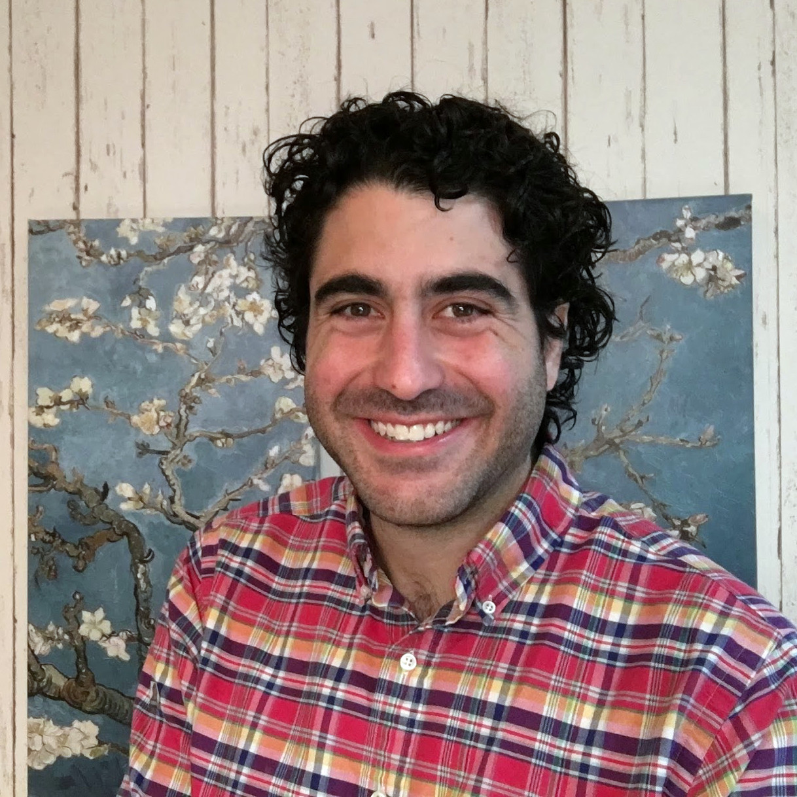

<table style="width:100%">
<tr>
<td style="width:280px"><b>Chris Baldassano</b>, PI: Chris got his PhD in Computer Science at Stanford (using machine learning methods to study the human visual system) before becoming a postdoc at the Princeton Neuroscience Institute and then an Assistant Professor in the Columbia Psychology Department.
 <a href="http://chrisbaldassano.com/">Personal Website</a>
 <a href="http://blog.chrisbaldassano.com/">Personal Blog</a>
 
</td>
<td style="width:200px"></td>
</tr>
</table>
