<table style="width:100%">
<tr>
<td style="width:280px"><b>Chris Baldassano:</b> Chris got his PhD in Computer Science at Stanford (using machine learning methods to study the human visual system) before becoming a postdoc at the Princeton Neuroscience Institute and then an Assistant Professor in the Columbia Psychology Department.
 <a href="http://chrisbaldassano.com/">Personal Website</a>
 <a href="http://blog.chrisbaldassano.com/">Personal Blog</a>
 
</td>
<td style="width:200px">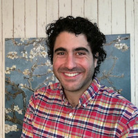</td>
</tr>
</table>

## Postdocs
<table style="width:100%">
<tr>
<td style="width:200px">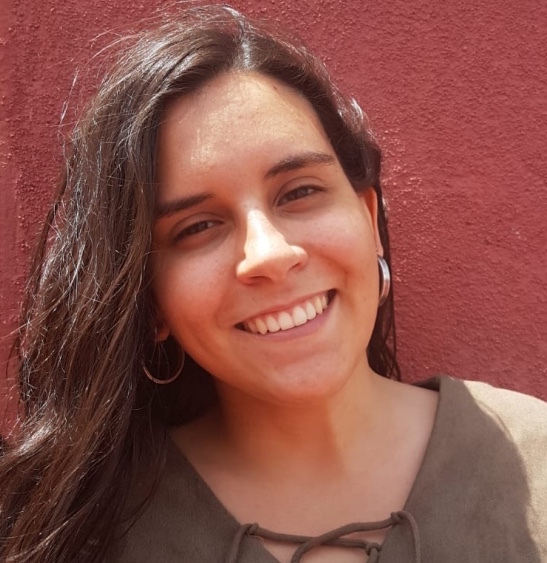</td>
<td style="width:280px"><b>Marta Silva</b>: After finishing her Integrated BSE/MSE in Biomedical and Biophysical Engineering, Marta joined the University of Barcelona for her doctoral students which were completed in 2023. In her work she focuses on breaking new ground on how memories from one's past get represented in the brain by tracking, prospectively, essential electrophysiology properties for everyone’s real-life episodic event experience.
 
</td>
</tr>
</table>

<table style="width:100%">
<tr>
<td style="width:280px"><b>Emily Meschke</b>: Emily's research investigates how attention shapes the flow of information across the brain, and the degree to which semantic representations support complex behavior, such as narrative recall and decision making. Before joining the DPM and Aly Labs, she earned her PhD in Neuroscience with Dr. Jack Gallant at UC Berkeley, where she examined how task and attentional state modulate semantic networks in the human brain. In her free time, she enjoys knitting and taking long walks with her pug-mix Delilah.
 
</td>
<td style="width:200px">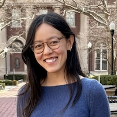</td>
</tr>
</table>

## PhD Students
<table style="width:100%">
<tr>
<td style="width:280px"><b>Taylor Chamberlain</b>: After finishing her BA at University of Chicago, Taylor worked as a software developer, and then returned to UChicago to work as a lab manager in the psychology department. She's interested in using fMRI and behavioral experiments to study how memory and attention interact, particularly in more naturalistic task paradigms. 
 
</td>
<td style="width:200px">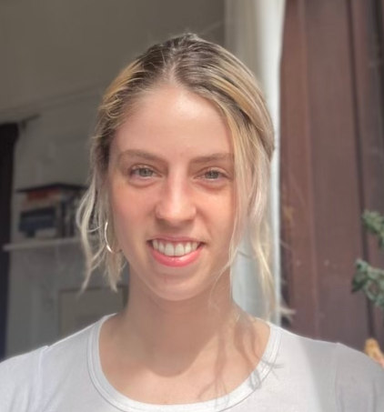</td>
</tr>
</table>

<table style="width:100%">
<tr>
<td style="width:200px">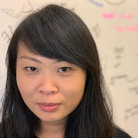</td>
<td style="width:280px"><b>Caroline Lee</b>: Caroline finished her MS in Computer Science at NYU's Courant Institute in 2017. She is interested in how the brain organizes and represents semantic structure and the use of machine-learning based joint-modeling approaches to explain the dynamics of brain and behavior. Her spare time is spent debugging TensorFlow code and attempting to play classical guitar.
 
</td>
</tr>
</table>

<table style="width:100%">
<tr>
<td style="width:280px"><b>Zall Hirschstein</b>: After graduating from Bard College as an advisee of Dr. Justin Hulbert, Zall spent two years at Albany Medical College doing neuropathology research and three years as the Aly Lab manager here at Columbia. He now joins both the DPM and Aly Labs as a graduate student to investigate how our memory systems coordinate with the rest of the brain to support the demands of attention and perception.
 
</td>
<td style="width:200px">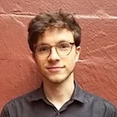</td>
</tr>
</table>

## Postbac students
<table style="width:100%">
<tr>
<td style="width:200px">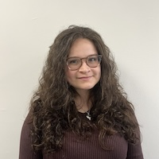</td>
<td style="width:280px"><b>Sophia Lukac</b>: Sophia is a Post-Baccalaureate Certificate student studying Psychology at Columbia. She graduated from Rutgers University with a B.A. in Cell Biology and Neuroscience. Sophia is also a research assistant with the Developmental Affective Neuroscience Lab at Columbia. Her research passions include memory, neuropsychology, and neurodevelopment and behavior.
 
</td>
</tr>
</table>

## Undergraduate RAs and Thesis students
<table style="width:100%">
<tr>
<td style="width:280px"><b>Caroline (Dana) Lauren Villamin</b>: Caroline is a Class of ’27 undergraduate at Barnard College studying Cognitive Science. She is interested in applying her background in linguistics to research how memory is organized in the brain in relation to language processing. In her free time she likes to play guitar, explore the city, and collect vintage postcards.
 
</td>
<td style="width:200px">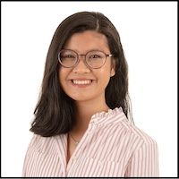</td>
</tr>
</table>

<table style="width:100%">
<tr>
<td style="width:200px">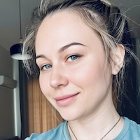</td>
<td style="width:280px"><b>Mariya Curry (Nataliia Viktorchuk)</b>: Mariya is a senior psychology major at Columbia University, completing her STAR Honors thesis on pupillometry and narrative processing. Her research studies how pupil responses at story boundaries reveal different types of expectations, testing whether individual cognitive filters show measurable differences. She is also pursuing a PhD in Educational and Pedagogical Sciences in Ukraine, and with a background in filmmaking, entrepreneurship, and analytical psychology, she integrates creative practice and scientific research to develop cross-cultural models of education and resilience.
 
</td>
</tr>
</table>

<table style="width:100%">
<tr>
<td style="width:280px"><b>Siddharth Maharishi</b>: Siddharth is a Columbia University undergraduate, Class of 2027, majoring in Neuroscience and Behavior with minors in Mathematics and Chemistry. He plans to become a physician-scientist and is conducting a senior thesis in the DPM Lab. His research interests include neural representations, memory, and event cognition, with broader interests in clinical and translational neuroscience, particularly trauma and the self. He is also co-founder and CEO of Elyzia, a health technology startup. More about his work is available at <a href="http://linkedin.com/in/siddharthmaharishi">linkedin.com/in/siddharthmaharishi</a>. 
 
</td>
<td style="width:200px">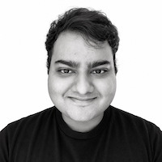</td>
</tr>
</table>

<table style="width:100%">
<tr>
<td style="width:200px">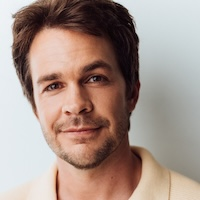</td>
<td style="width:280px"><b>Johnny Simmons</b>: Johnny is a junior at Columbia University, majoring in Psychology. An actor in film, he is interested in neural coupling, the way listeners' brain activity falls into step with the storyteller's and with one another's as a story unfolds. This semester he is reading the imaging research on how that coupling rises and falls with engagement, and asking what changes when an audience is in the room with a performer instead of watching a screen. In his free time, he enjoys photography and writing.
 
</td>
</tr>
</table>

<table style="width:100%">
<tr>
<td style="width:280px"><b>Ashlynn Alexander</b>: Ashlynn is a senior at Columbia GS majoring in Cognitive Science. She is interested in a research career focused on differential cognitive processing in autistic populations, and her senior thesis will compare loss aversion levels in autistic adults for monetary losses versus special-interest-related losses. Outside of academia, Ashlynn loves beaches, museums, and seeing as many Broadway shows as she can. 
 
</td>
<td style="width:200px">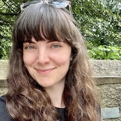</td>
</tr>
</table>

## Former Lab Members
<b>Postdocs</b>
* <a href="https://hallezucker.com/">Halle Dimsdale-Zucker</a>
* <a href="https://sites.google.com/view/samanthacohen/home">Samantha Cohen</a>
* <a href="http://www.matthewsachs.com/">Matthew Sachs</a>

<b>PhD students</b>
* Hannah Tarder-Stoll
* Matt Siegelman
* Jiawen Huang

<b>Postbac/MS students</b>
* Narjes Al-Zahli
* <a href="https://maxs.world/">Max Bennett</a>
* KyungHwan Chee
* Xinran Liu

<b>Undergraduate students</b>
* Sudheshna Khadka
* Paulina Bertilsson
* Joselyn Ellis
* Leandra Quick
* Sareena Parikh
* Erika Gonzalez
* Gabriella Calabia
* Katie Mae Peters
* Yifang Liu
* Hannah Zeng
* Sunjae Shim
* Mareike Keller
* Gloria Charite
* Karina Feng
* Sam Hutchinson
* Philip Tham
* Ainsley Cunningham
* Jaeho Kim
* Francesca Castellarin
* Ellie Suzuki
* Akshay Manglik
* Morell Kenmoe
