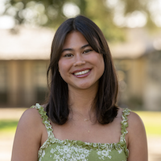
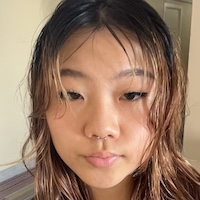

<table style="width:100%">
<tr>
<td style="width:280px"><b>Chris Baldassano:</b> Chris got his PhD in Computer Science at Stanford (using machine learning methods to study the human visual system) before becoming a postdoc at the Princeton Neuroscience Institute and then an Assistant Professor in the Columbia Psychology Department.
 <a href="http://chrisbaldassano.com/">Personal Website</a>
 <a href="http://blog.chrisbaldassano.com/">Personal Blog</a>
 
</td>
<td style="width:200px"></td>
</tr>
</table>

## Postdocs
<table style="width:100%">
<tr>
<td style="width:200px"></td>
<td style="width:280px"><b>Marta Silva</b>: After finishing her Integrated BSE/MSE in Biomedical and Biophysical Engineering, Marta joined the University of Barcelona for her doctoral students which were completed in 2023. In her work she focuses on breaking new ground on how memories from one's past get represented in the brain by tracking, prospectively, essential electrophysiology properties for everyone’s real-life episodic event experience.
 
</td>
</tr>
</table>

## PhD Students
<table style="width:100%">
<tr>
<td style="width:200px"></td>
<td style="width:280px"><b>Jiawen Huang</b>: After finishing UCL’s BSc Psychology program, Jiawen stayed at UCL as a RA to build a database of people watching movies in fMRI. He is interested in how memory works in context, such as during movie viewing. He also hopes to explore methods to study memory with more complex tasks such as interactive games. 
 
</td>
</tr>
</table>

<table style="width:100%">
<tr>
<td style="width:280px"><b>Taylor Chamberlain</b>: After finishing her BA at University of Chicago, Taylor worked as a software developer, and then returned to UChicago to work as a lab manager in the psychology department. She's interested in using fMRI and behavioral experiments to study how memory and attention interact, particularly in more naturalistic task paradigms. 
 
</td>
<td style="width:200px"></td>
</tr>
</table>

<table style="width:100%">
<tr>
<td style="width:200px"></td>
<td style="width:280px"><b>Caroline Lee</b>: Caroline finished her MS in Computer Science at NYU's Courant Institute in 2017. She is interested in how the brain organizes and represents semantic structure and the use of machine-learning based joint-modeling approaches to explain the dynamics of brain and behavior. Her spare time is spent debugging TensorFlow code and attempting to play classical guitar.
 
</td>
</tr>
</table>

<table style="width:100%">
<tr>
<td style="width:280px"><b>Zall Hirschstein</b>: After graduating from Bard College as an advisee of Dr. Justin Hulbert, Zall spent two years at Albany Medical College doing neuropathology research and three years as the Aly Lab manager here at Columbia. He now joins both the DPM and Aly Labs as a graduate student to investigate how our memory systems coordinate with the rest of the brain to support the demands of attention and perception.
 
</td>
<td style="width:200px"></td>
</tr>
</table>

## Lab manager
<table style="width:100%">
<tr>
<td style="width:280px"><b>Narjes Al-Zahli</b>: After finishing her BA in Computer Science and Psychology at Columbia University, Narjes joined the DPM and Aly Labs as a lab manager and research assistant. She is interested in understanding the connection between temporal schemas, time perception, and predictability. In her free time, she enjoys rock-climbing, reading and being in nature.
 
</td>
<td style="width:200px"></td>
</tr>
</table>

## Research Assistants
<table style="width:100%">
<tr>
<td style="width:280px"><b>Francesca Castellarin</b>: Francesca is a rising junior at Barnard College studying Cognitive Science. She is interested in learning more about social cognition as it relates to neural representations of information and events and how these representations might vary across cultures. In her free time, she enjoys exploring the city, yoga, and spending time with friends and family.
 
</td>
<td style="width:200px"></td>
</tr>
</table>

<table style="width:100%">
<tr>
<td style="width:200px"></td>
<td style="width:280px"><b>Ellie Suzuki</b>: Ellie is at Barnard studying Cognitive Science. She is interested in consciousness, as well as the intersection of art—especially music—and the brain. In her free time she is either finding new albums to listen to or is outside enjoying nature.
 
</td>
</tr>
</table>

<table style="width:100%">
<tr>
<td style="width:280px"><b>Akshay Manglik</b>: Akshay is an undergraduate at Columbia College studying Computer Science. He is interested in applying computational techniques to analyze neural representations in neuroimaging, especially in the context of memory and imagination. In his free time, he enjoys dancing as a part of Columbia Raas, participating in Quiz Bowl, and baking.
 
</td>
<td style="width:200px"></td>
</tr>
</table>

<table style="width:100%">
<tr>
<td style="width:200px"></td>
<td style="width:280px"><b>Morell Kenmoe</b>: Morell is a class of '25 pre-med student at Columbia University studying Neuroscience and Behavior. He is interested in learning more about human behavior and decision making from both the psychological and biological perspectives. In his free time he enjoys playing basketball, listening to music, and spending time with friends and family.
 
</td>
</tr>
</table>

<table style="width:100%">
<tr>
<td style="width:280px"><b>Gabriella Calabia</b>: Gabriella is an I.I. Rabi Research Scholar at Columbia College studying Cognitive Science and English literature. She investigates memory, time, and the conceptualization of narratives through the intersection of neuroscience and film. Gabriella is also an editor on <i>The Gadfly</i>, Columbia’s philosophy magazine, and vice president of the Columbia Undergrad Sketch Show. Outside of the lab, she loves hiking, skiing, and painting.
 
</td>
<td style="width:200px"></td>
</tr>
</table>

<table style="width:100%">
<tr>
<td style="width:200px"></td>
<td style="width:280px"><b>Caroline (Dana) Lauren Villamin</b>: Caroline is a Class of ’27 undergraduate at Barnard College studying Cognitive Science. She is interested in applying her background in linguistics to research how memory is organized in the brain in relation to language processing. In her free time she likes to play guitar, explore the city, and collect vintage postcards.
 
</td>
</tr>
</table>

## Former Lab Members

<b>Katie Mae Peters</b> (Undergraduate Senior Thesis student)

<b>Yifang Liu</b> (Undergraduate Senior Thesis student)

<b>Hannah Zeng</b> (Undergraduate Senior Thesis student)

<b><a href="https://hallezucker.com/">Halle Dimsdale-Zucker</a></b> (Postdoc)

<b><a href="https://sites.google.com/view/samanthacohen/home">Samantha Cohen</a></b> (Postdoc)

<b><a href="http://www.matthewsachs.com/">Matthew Sachs</a></b> (Postdoc)

<b>Hannah Tarder-Stoll</b> (PhD student)

<b>Matt Siegelman</b> (PhD student)

<b><a href="https://maxs.world/">Max Bennett</a></b> (MS, Computer Science)

<b>Sunjae Shim</b> (Undergraduate Senior Thesis student)

<b>Mareike Keller</b> (Undergraduate Senior Thesis student)

<b>Gloria Charite</b> (Undergraduate Senior Thesis student)

<b>Karina Feng</b> (Undergraduate Senior Thesis student)

<b>Sam Hutchinson</b> (Undergraduate Senior Thesis student)
