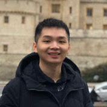

<table style="width:100%">
<tr>
<td style="width:280px"><b>Chris Baldassano:</b> Chris got his PhD in Computer Science at Stanford (using machine learning methods to study the human visual system) before becoming a postdoc at the Princeton Neuroscience Institute and then an Assistant Professor in the Columbia Psychology Department.
 <a href="http://chrisbaldassano.com/">Personal Website</a>
 <a href="http://blog.chrisbaldassano.com/">Personal Blog</a>
 
</td>
<td style="width:200px"></td>
</tr>
</table>

## Current Lab Members

### Postdocs
<table style="width:100%">
<tr>
<td style="width:280px"><b>Matthew Sachs</b> (Presidential Scholars in Society and Neuroscience program): Matt received his PhD from the University of Southern California’s in Dr. Antonio Damasio's Brain and Creativity Institute. His research focuses on modeling the neural and behavioral mechanisms involved in emotional and rewarding responses to naturalistic stimuli, such as music and film. 
 <a href="http://www.matthewsachs.com/">Personal Website</a>
 
</td>
  <td style="width:200px"></td>
</tr>
</table>

<table style="width:100%">
<tr>
<td style="width:200px"></td>
<td style="width:280px"><b>Halle Dimsdale-Zucker</b>: Halle is finishing up her PhD in cognitive neuroscience at UC Davis before joining the DPM and Aly labs as a postdoc. She has been studying memory since her freshman year of college (and yet still struggles to remember peoples' names). 
 <a href="https://hallezucker.com/">Personal Website</a>
 
</td>
</tr>
</table>

<table style="width:100%">
<tr>
<td style="width:280px"><b>Samantha Cohen</b>: Samantha completed a PhD in Psychology in the lab of Dr. Lucas Parra at The City University of New York. During her time there, she used EEG responses to dynamic naturalistic videos to better understand the modulation of attention and memory.
 <a href="https://www.parralab.org/people/samantha/">Personal Website</a>
 
</td>
<td style="width:200px"></td>
</tr>
</table>

### PhD Students
<table style="width:100%">
<tr>
<td style="width:200px"></td>
<td style="width:280px"><b>Hannah Tarder-Stoll</b>: Before starting at Columbia, Hannah received an Honours BSc from the University of Toronto in 2018 with a double major in psychology and neuroscience. She is interested in the modulation of episodic memory and how the hippocampus interacts with prefrontal regions to integrate new information into previous memory stores.
 
</td>
</tr>
</table>

<table style="width:100%">
<tr>
<td style="width:280px"><b>Matt Siegelman</b>: Matt grew up outside Philadelphia and got his undergraduate degree in Neuroscience from Wesleyan in 2016. He worked as an RA in a language lab at MIT before joining the DPM lab at Columbia, where he hopes to apply AI, natural language processing tools and naturalistic stimuli to study concept representations in memory. 
 
</td>
<td style="width:200px"></td>
</tr>
</table>

<table style="width:100%">
<tr>
<td style="width:200px"></td>
<td style="width:280px"><b>Jiawen Huang</b>: After finishing from UCL’s BSc Psychology program, Jiawen stayed at UCL as a RA to build a database of people watching movies in fMRI. He is interested in how memory works in context, such as during movie viewing. He also hopes to explore methods to study memory with more complex tasks such as interactive games. 
 
</td>
</tr>
</table>

### Lab managers
<table style="width:100%">
<tr>
<td style="width:280px"><b>Alexandra Reblando</b>: Alex enjoys contemplating the forms of schemas: their creation, machinations, and interaction with perception and memory. In repose, she works on expanding her own schemas particularly those of art museums, restaurants, and dingy music venues.
 
</td>
<td style="width:200px"></td>
</tr>
</table>

### Undergraduate honors students
<table style="width:100%">
<tr>
  <td style="width:200px"></td>
<td style="width:280px"><b>Sunjae Shim</b>: Sunjae is an undergraduate student at Columbia University studying psychology. She is interested in combining her interests in psychology and film studies to look into how people perceive naturalistic stimuli. Outside of school work, she likes binge watching TV shows with her hamster, Tiramisu.
 
</td>
</tr>
</table>

## Former Lab Members
<table style="width:100%">
<tr>
<td style="width:200px"></td>
<td style="width:280px"><b>Caroline Lee</b>, Volunteer research assistant: Caroline finished her MS in Computer Science at NYU's Courant Institute in 2017. She is interested in how the brain organizes and represents semantic structure and the use of machine-learning based joint-modeling approaches to explain the dynamics of brain and behavior. Her spare time is spent debugging TensorFlow code in Pat Shafto’s lab and attempting to play classical guitar.
 
</td>
</tr>
</table>

<table style="width:100%">
<tr>
<td style="width:280px"><b>Labeebah Subair</b>, Summer research assistant: Labeebah is a rising sophomore at Yale University who hopes to pursue her undergraduate degree in psychology and neuroscience. She is interested in how the brain processes psychological trauma, formulates memories, and promotes habitual neural activity. This interest is rooted in her passion for social justice and hope to relate concepts of trauma to identity and discrimination. 
 
</td>
<td style="width:200px"></td>
</tr>
</table>

<table style="width:100%">
<tr>
<td style="width:200px"></td>
<td style="width:280px"><b>Sophia Africk</b>, Summer intern: Sophia is a senior at Trinity School in New York City, where she is interested in math and psychology.  In her free time, she enjoys trying new restaurants around the city.
 
</td>
</tr>
</table>
