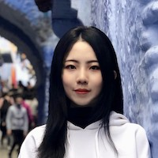
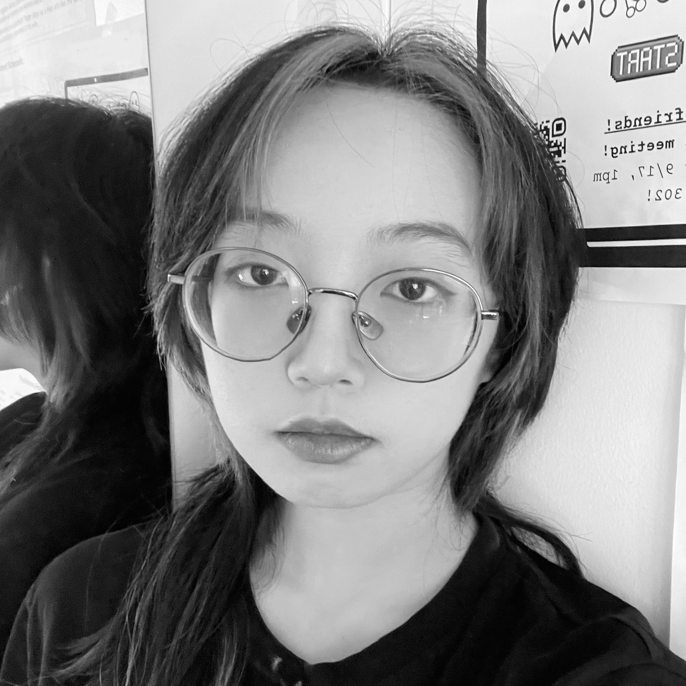

<table style="width:100%">
<tr>
<td style="width:280px"><b>Chris Baldassano:</b> Chris got his PhD in Computer Science at Stanford (using machine learning methods to study the human visual system) before becoming a postdoc at the Princeton Neuroscience Institute and then an Assistant Professor in the Columbia Psychology Department.
 <a href="http://chrisbaldassano.com/">Personal Website</a>
 <a href="http://blog.chrisbaldassano.com/">Personal Blog</a>
 
</td>
<td style="width:200px"></td>
</tr>
</table>

## PhD Students
<table style="width:100%">
<tr>
<td style="width:200px"></td>
<td style="width:280px"><b>Jiawen Huang</b>: After finishing UCL’s BSc Psychology program, Jiawen stayed at UCL as a RA to build a database of people watching movies in fMRI. He is interested in how memory works in context, such as during movie viewing. He also hopes to explore methods to study memory with more complex tasks such as interactive games. 
 
</td>
</tr>
</table>

<table style="width:100%">
<tr>
<td style="width:280px"><b>Taylor Chamberlain</b>: After finishing her BA at University of Chicago, Taylor worked as a software developer, and then returned to UChicago to work as a lab manager in the psychology department. She's interested in using fMRI and behavioral experiments to study how memory and attention interact, particularly in more naturalistic task paradigms. 
 
</td>
<td style="width:200px"></td>
</tr>
</table>

<table style="width:100%">
<tr>
<td style="width:200px"></td>
<td style="width:280px"><b>Caroline Lee</b>: Caroline finished her MS in Computer Science at NYU's Courant Institute in 2017. She is interested in how the brain organizes and represents semantic structure and the use of machine-learning based joint-modeling approaches to explain the dynamics of brain and behavior. Her spare time is spent debugging TensorFlow code and attempting to play classical guitar.
 
</td>
</tr>
</table>

<table style="width:100%">
<tr>
<td style="width:280px"><b>Zall Hirschstein</b>: After graduating from Bard College as an advisee of Dr. Justin Hulbert, Zall spent two years at Albany Medical College doing neuropathology research and three years as the Aly Lab manager here at Columbia. He now joins both the DPM and Aly Labs as a graduate student to investigate how our memory systems coordinate with the rest of the brain to support the demands of attention and perception.
 
</td>
<td style="width:200px"></td>
</tr>
</table>

## Lab manager
<table style="width:100%">
<tr>
<td style="width:280px"><b>Alexandra Reblando</b>: Alex enjoys contemplating the forms of schemas: their creation, machinations, and interaction with perception and memory. In repose, she works on expanding her own schemas particularly those of art museums, restaurants, and dingy music venues.
 
</td>
<td style="width:200px"></td>
</tr>
</table>

## Undergraduate Senior Thesis students
<table style="width:100%">
<tr>
<td style="width:200px"></td>
<td style="width:280px"><b>Katie Mae Peters</b>: Katie Mae Peters' passion for action films started the moment she watched Keanu jump a bus over the gap in an incomplete LA freeway. Since then she spent the past ten years in the film industry gaining experience by working with everyone from Dog the Bounty Hunter to Ron Burgandy. Her eye for creative producing has led her to create several award winning films and earn several grants including a 2021 Hollywood Foreign Press Fellowship. She currently attends Columbia University where she is researching the negative impacts certain color grading and production design choices in film have on the way audiences form empathetic attachments to POC characters and foreign countries.
 
</td>
</tr>
</table>

<table style="width:100%">
<tr>
<td style="width:280px"><b>Yifang Liu</b>: As a junior studying Neuroscience and Behavior at the School of General Studies, Yifang is currently working on her senior thesis project that delves into the effects of agency on memory performance in multi-step sequential planning. Her project was inspired by her love for gaming and seeks to investigate how agency can impact memory in more realistic contexts. She also explores her passions for photography and video games in her free time. These creative pursuits serve as a wellspring of inspiration for her, especially when it comes to the naturalistic stimuli they offer!
 
</td>
<td style="width:200px"></td>
</tr>
</table>

<table style="width:100%">
<tr>
<td style="width:280px"><b>Hannah Zeng</b>: When Hannah Zeng is not hopping around making interfaces and installations, she studies cognitive science. She joins the lab to understand how we dynamically make sense of the ever-changing event structure in the real world, such as appreciating a piece of music or playing games. She has written about science as a science communicator and translator, which is part of her small attempt to promote open science.
 
</td>
  <td style="width:200px"></td>
</tr>
</table>

## Research Assistants
<table style="width:100%">
<tr>
<td style="width:280px"><b>Elen Zhu</b>: Elen is a sophomore at Columbia College pursuing a Bachelor’s degree in Neuroscience and Behavior. She is interested in the mechanisms in play between perception and memory. In her free time, she enjoys sewing, crocheting, attempting to paint and spending time with friends and family.
 
</td>
<td style="width:200px"></td>
</tr>
</table>

<table style="width:100%">
<tr>
<td style="width:200px"></td>
<td style="width:280px"><b>Ezgi Oztelcan</b>: Ezgi is a third-year UC Berkeley psychology student from Istanbul, Turkey, aiming to further develop her scientific approach skills and practice in different specializations in psychology to support shaping future academic and career goals. She is eager to learn new ways to continuously improve herself academically, professionally, and socially. She is interested in how evolutionary developmental processes affect the human brain on a neurological basis, with an emphasis on language development! In her free time, she enjoys petsitting for her friends, skiing, and playing around with analog cameras.
 
</td>
</tr>
</table>

<table style="width:100%">
<tr>
<td style="width:280px"><b>Tony Kim</b>: Tony is a pre-medical undergraduate student at Columbia studying neuroscience and philosophy. He is interested in how episodic and semantic schemas affect information processing, as well as mechanisms behind hippocampal neurogenesis. In his free time, he enjoys reading, watching basketball, and walking his dog.
 
</td>
<td style="width:200px"></td>
</tr>
</table>

<table style="width:100%">
<tr>
  <td style="width:200px"></td>
<td style="width:280px"><b>Allie Yuxin Lin</b>: Allie is a sophomore undergraduate studying Political Science and Psychology at Columbia. She is interested in combining her two majors in the study of political psychology, and is fascinated by the world of neuropsychology. When she's not frantically working on academic work, she enjoys writing poetry and creating visual art with watercolor and occasionally ink and water.
 
</td>
</tr>
</table>

<table style="width:100%">
<tr>
<td style="width:280px"><b>Angel Latt</b>: Angel is an undergraduate student at Columbia College studying Neuroscience and Behavior. She is interested in gaining insights into human behavior, particularly in the field of neural mechanisms and developmental neurology. In addition to her love for all things brain related, she is also passionate about promoting science and health education to the broader general public. When she isn’t in the lab or doesn’t have her nose stuck in a textbook, she enjoys exploring the city, reading, volunteering, listening to all kinds of music, and baking too much.
 
</td>
  <td style="width:200px"></td>
</tr>
</table>

<table style="width:100%">
<tr>
  <td style="width:200px"></td>
<td style="width:280px"><b>Akshay Manglik</b>: Akshay is an undergraduate at Columbia College studying Computer Science. He is interested in applying computational techniques to analyze neural representations in neuroimaging, especially in the context of memory and imagination. In his free time, he enjoys dancing as a part of Columbia Raas, participating in Quiz Bowl, and baking.
 
</td>
</tr>
</table>

<table style="width:100%">
<tr>
<td style="width:280px"><b>Morell Kenmoe</b>: Morell is a class of '25 pre-med student at Columbia University studying Neuroscience and Behavior. He is interested in learning more about human behavior and decision making from both the psychological and biological perspectives. In his free time he enjoys playing basketball, listening to music, and spending time with friends and family.
 
</td>
<td style="width:200px"></td>
</tr>
</table>

## Former Lab Members
<b><a href="https://hallezucker.com/">Halle Dimsdale-Zucker</a></b> (Postdoc)

<b><a href="https://sites.google.com/view/samanthacohen/home">Samantha Cohen</a></b> (Postdoc)

<b><a href="http://www.matthewsachs.com/">Matthew Sachs</a></b> (Postdoc)

<b>Hannah Tarder-Stoll</b> (PhD student)

<b>Matt Siegelman</b> (PhD student)

<b><a href="https://maxs.world/">Max Bennett</a></b> (MS, Computer Science)

<b>Sunjae Shim</b> (Undergraduate Senior Thesis student)

<b>Mareike Keller</b> (Undergraduate Senior Thesis student)

<b>Gloria Charite</b> (Undergraduate Senior Thesis student)

<b>Karina Feng</b> (Undergraduate Senior Thesis student)

<b>Sam Hutchinson</b> (Undergraduate Senior Thesis student)

<b>Franck Mugisho</b> (Research Assistant)

<b>Rachel Nielson</b> (Research Assistant)

<b>Julia Soares</b> (Research Assistant)

<b>Isabel Velarde</b> (Research Assistant)

<b>Chloe Lambert</b> (Research Assistant)

<b>Yumiko Wiranto</b> (Research Assistant)

<b>Jason Wang</b> (Research Assistant)

<b>Cindy Gao</b> (Research Assistant)

<b>Sophie Blitsman</b> (Research Assistant)

<b>Zion Walker</b> (Research Assistant)

<b>Silvia Toderas</b> (Research Assistant)

<b>Caroline Lee</b> (Research Assistant)

<b>Labeebah Subair</b> (Research Assistant)

<b>Sophia Africk</b> (Research Assistant)
