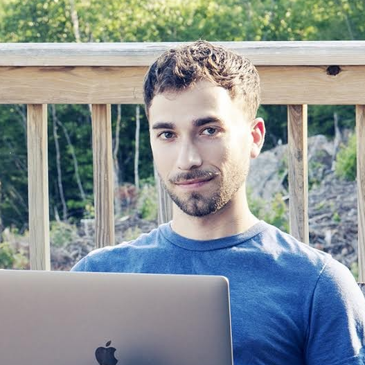

<table style="width:100%">
<tr>
<td style="width:280px"><b>Chris Baldassano</b>, PI: Chris got his PhD in Computer Science at Stanford (using machine learning methods to study the human visual system) before becoming a postdoc at the Princeton Neuroscience Institute and then an Assistant Professor in the Columbia Psychology Department.
 <a href="http://chrisbaldassano.com/">Personal Website</a>
 <a href="http://blog.chrisbaldassano.com/">Personal Blog</a>
 
</td>
<td style="width:200px"></td>
</tr>
</table>

<table style="width:100%">
<tr>
<td style="width:200px"></td>
<td style="width:280px"><b>Halle Dimsdale-Zucker</b>, Postdoc: Halle is finishing up her PhD in cognitive neuroscience at UC Davis before joining the DPM and Aly labs as a postdoc. She has been studying memory since her freshman year of college (and yet still struggles to remember peoples' names). 
 <a href="https://hallezucker.com/">Personal Website</a>
 
</td>
</tr>
</table>

<table style="width:100%">
<tr>
<td style="width:280px"><b>Samantha Cohen</b>, Postdoc: Samantha completed a PhD in Psychology in the lab of Dr. Lucas Parra at The City University of New York. During her time there, she used EEG responses to dynamic naturalistic videos to better understand the modulation of attention and memory.
 <a href="https://www.parralab.org/people/samantha/">Personal Website</a>
 
</td>
<td style="width:200px"></td>
</tr>
</table>

<table style="width:100%">
<tr>
<td style="width:200px"></td>
<td style="width:280px"><b>Hannah Tarder-Stoll</b>, PhD student: Before starting at Columbia, Hannah received an Honours BSc from the University of Toronto in 2018 with a double major in psychology and neuroscience. She is interested in the modulation of episodic memory and how the hippocampus interacts with prefrontal regions to integrate new information into previous memory stores.
 
</td>
</tr>
</table>

<table style="width:100%">
<tr>
<td style="width:280px"><b>Matt Siegelman</b>, PhD student: Matt grew up outside Philadelphia and got his undergraduate degree in Neuroscience from Wesleyan in 2016. He worked as an RA in a language lab at MIT before joining the DPM lab at Columbia, where he hopes to apply AI, natural language processing tools and naturalistic stimuli to study concept representations in memory. 
 
</td>
<td style="width:200px"></td>
</tr>
</table>

<table style="width:100%">
<tr>
<td style="width:200px"></td>
<td style="width:280px"><b>Alexandra Reblando</b>, Research assistant: Alex enjoys contemplating the forms of schemas: their creation, machinations, and interaction with perception and memory. In repose, she works on expanding her own schemas particularly those of art museums, restaurants, and dingy music venues.
 
</td>
</tr>
</table>
