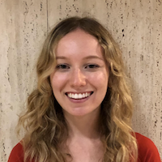
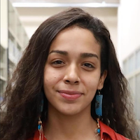
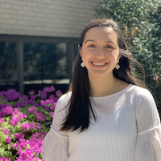
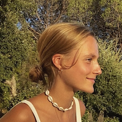
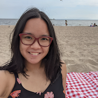

<table style="width:100%">
<tr>
<td style="width:280px"><b>Chris Baldassano:</b> Chris got his PhD in Computer Science at Stanford (using machine learning methods to study the human visual system) before becoming a postdoc at the Princeton Neuroscience Institute and then an Assistant Professor in the Columbia Psychology Department.
 <a href="http://chrisbaldassano.com/">Personal Website</a>
 <a href="http://blog.chrisbaldassano.com/">Personal Blog</a>
 
</td>
<td style="width:200px"></td>
</tr>
</table>

## Postdocs
<table style="width:100%">
<tr>
<td style="width:200px"></td>
<td style="width:280px"><b>Halle Dimsdale-Zucker</b>: Halle completed her PhD in cognitive neuroscience at UC Davis before joining the DPM and Aly labs as a postdoc. She has been studying memory since her freshman year of college (and yet still struggles to remember peoples' names).
 <a href="https://hallezucker.com/">Personal Website</a>
 
</td>
</tr>
</table>

## PhD Students
<table style="width:100%">
<tr>
<td style="width:200px"></td>
<td style="width:280px"><b>Hannah Tarder-Stoll</b>: Before starting at Columbia, Hannah received an Honours BSc from the University of Toronto in 2018 with a double major in psychology and neuroscience. She is interested in the modulation of episodic memory and how the hippocampus interacts with prefrontal regions to integrate new information into previous memory stores.
 
</td>
</tr>
</table>

<table style="width:100%">
<tr>
<td style="width:280px"><b>Matt Siegelman</b>: Matt grew up outside Philadelphia and got his undergraduate degree in Neuroscience from Wesleyan in 2016. He worked as an RA in a language lab at MIT before joining the DPM lab at Columbia, where he hopes to apply AI, natural language processing tools and naturalistic stimuli to study concept representations in memory. 
 
</td>
<td style="width:200px"></td>
</tr>
</table>

<table style="width:100%">
<tr>
<td style="width:200px"></td>
<td style="width:280px"><b>Jiawen Huang</b>: After finishing from UCL’s BSc Psychology program, Jiawen stayed at UCL as a RA to build a database of people watching movies in fMRI. He is interested in how memory works in context, such as during movie viewing. He also hopes to explore methods to study memory with more complex tasks such as interactive games. 
 
</td>
</tr>
</table>

## Lab manager
<table style="width:100%">
<tr>
<td style="width:280px"><b>Alexandra Reblando</b>: Alex enjoys contemplating the forms of schemas: their creation, machinations, and interaction with perception and memory. In repose, she works on expanding her own schemas particularly those of art museums, restaurants, and dingy music venues.
 
</td>
<td style="width:200px"></td>
</tr>
</table>

## Undergraduate Senior Thesis students
<table style="width:100%">
<tr>
<td style="width:280px"><b>Katie Mae Peters</b>: Katie Mae Peters' passion for action films started the moment she watched Keanu jump a bus over the gap in an incomplete LA freeway. Since then she spent the past ten years in the film industry gaining experience by working with everyone from Dog the Bounty Hunter to Ron Burgandy. Her eye for creative producing has led her to create several award winning films and earn several grants including a 2021 Hollywood Foreign Press Fellowship. She currently attends Columbia University where she is researching the negative impacts certain color grading and production design choices in film have on the way audiences form empathetic attachments to POC characters and foreign countries.
 
</td>
<td style="width:200px"></td>
</tr>
</table>

<table style="width:100%">
<tr>
<td style="width:200px"></td>
<td style="width:280px"><b>Gloria Charite</b>: Gloria is a CC’2023 undergraduate student in Columbia College studying Psychology. She is interested in understanding the process underlying learning, specifically the ways in which information can be presented to maximize encoding, retention and later retrieval. In the future, she hopes to contribute to bridging the gap between cognitive psychology and education. That is, using contemporary knowledge on the functioning of memory systems to enrich classroom and learning experiences in general. Outside of school work, she enjoys reading and having "intellectual" conversations with friends.
 
</td>
</tr>
</table>

<table style="width:100%">
<tr>
<td style="width:280px"><b>Karina Feng</b>: Karina is an undergraduate at Columbia College studying Psychology and Statistics. She is interested in how identity interacts with memory and how it informs human behavior, as well as the intersection of machine learning and psychology. In her free time, she enjoys photography, baking, and sewing.
 
</td>
<td style="width:200px"></td>
</tr>
</table>

## Research Assistants
<table style="width:100%">
<tr>
<td style="width:280px"><b>Rachel Nielson</b>: Rachel is a second-year undergraduate at Columbia University (Dual BA with List College). Currently, she is studying Neuroscience and Ethics. She is most interested in the complexities of memory and the science behind learning. She is also passionate about neurodiversity advocacy. Fun Fact: She is from the opposite coast of the country (California). West coast best coast!
 
</td>
<td style="width:200px"></td>
</tr>
</table>

<table style="width:100%">
<tr>
<td style="width:200px"></td>
<td style="width:280px"><b>Julia Soares</b>: Julia is a junior at Columbia University majoring in Neuroscience and Behavior. She is interested in the molecular mechanisms behind memory retrieval and encoding. In her free time, she enjoys reading, roller skating, and making collages.
 
</td>
</tr>
</table>

<table style="width:100%">
<tr>
<td style="width:280px"><b>Isabel Velarde</b>: Isabel is a recent graduate of Fordham University with a double major in mathematics and philosophy. She is currently a post-bac student in Psychology at Columbia University and is hoping to study something related to memory or language.
 
</td>
<td style="width:200px"></td>
</tr>
</table>

<table style="width:100%">
<tr>
<td style="width:200px"></td>
<td style="width:280px"><b>Chloe Lambert</b>: Chloe is a sophomore at Columbia University studying Neuroscience and Mathematics. She is interested in the neural mechanisms underlying decision making, memory and learning. Music plays a large role in her life as she is a singer/songwriter. She also enjoys walking around the city, going to museums and photography.
</td>
</tr>
</table>

<table style="width:100%">
<tr>
<td style="width:280px"><b>Yumiko Wiranto</b>: Yumiko is a second-year master’s student in Psychology in Education at Teachers College, Columbia University. Her research interest revolves around prevention, assessment, and neurorehabilitation in the population suffering from cognitive decline (e.g., MCI and dementia), and its impact on memory.  Outside of the academic setting, Yumiko enjoys dancing, playing the piano, and engaging in aquatic activities.
</td>
<td style="width:200px"></td>
</tr>
</table>

<table style="width:100%">
<tr>
<td style="width:200px"></td>
<td style="width:280px"><b>Franck Mugisho</b>: Franck is a rising sophomore at Columbia University pursuing a Bachelor’s degree in Computer Science. He enjoys reading about the brain and psychology in general and is interested in designing computer software that will shed light on how the brain processes information. Franck’s hobbies include watching soccer games, biking, running, and spending time with family and friends.
 
</td>
</tr>
</table>

<table style="width:100%">
<tr>
<td style="width:280px"><b>Elen Zhu</b>: Elen is a sophomore at Columbia College pursuing a Bachelor’s degree in Neuroscience and Behavior. She is interested in the mechanisms in play between perception and memory. In her free time, she enjoys sewing, crocheting, attempting to paint and spending time with friends and family.
 
</td>
<td style="width:200px"></td>
</tr>
</table>

<table style="width:100%">
<tr>
<td style="width:200px"></td>
<td style="width:280px"><b>Ezgi Oztelcan</b>: Ezgi is a third-year UC Berkeley psychology student from Istanbul, Turkey, aiming to further develop her scientific approach skills and practice in different specializations in psychology to support shaping future academic and career goals. She is eager to learn new ways to continuously improve herself academically, professionally, and socially. She is interested in how evolutionary developmental processes affect the human brain on a neurological basis, with an emphasis on language development! In her free time, she enjoys petsitting for her friends, skiing, and playing around with analog cameras.
 
</td>
</tr>
</table>

<table style="width:100%">
<tr>
<td style="width:280px"><b>Tony Kim</b>: Tony is a pre-medical undergraduate student at Columbia studying neuroscience and philosophy. He is interested in how episodic and semantic schemas affect information processing, as well as mechanisms behind hippocampal neurogenesis. In his free time, he enjoys reading, watching basketball, and walking his dog.
 
</td>
<td style="width:200px"></td>
</tr>
</table>

<table style="width:100%">
<tr>
<td style="width:200px"></td>
<td style="width:280px"><b>Jason Wang</b>: Jason Wang is a senior in Columbia College who values curiosity and creativity above all else. As a Neuroscience student on the premed track as well as a violinist, he is always on the lookout for new possibilities to fuse artistic mindfulness with psychiatric methods. Over the summer of 2019, he worked as an artist and curator in the Athens Curatorial Project, where he created an audio installation that explored the prevalence and impact of cultural clichés on the Greek collective unconscious.
 
</td>
</tr>
</table>

<table style="width:100%">
<tr>
<td style="width:280px"><b>Allie Yuxin Lin</b>: Allie is a sophomore undergraduate studying Political Science and Psychology at Columbia. She is interested in combining her two majors in the study of political psychology, and is fascinated by the world of neuropsychology. When she's not frantically working on academic work, she enjoys writing poetry and creating visual art with watercolor and occasionally ink and water.
 
</td>
<td style="width:200px"></td>
</tr>
</table>

<table style="width:100%">
<tr>
<td style="width:200px"></td>
<td style="width:280px"><b>Angel Latt</b>: Angel is an undergraduate student at Columbia College studying Neuroscience and Behavior. She is interested in gaining insights into human behavior, particularly in the field of neural mechanisms and developmental neurology. In addition to her love for all things brain related, she is also passionate about promoting science and health education to the broader general public. When she isn’t in the lab or doesn’t have her nose stuck in a textbook, she enjoys exploring the city, reading, volunteering, listening to all kinds of music, and baking too much.
 
</td>
</tr>
</table>

## Former Lab Members
<b><a href="https://sites.google.com/view/samanthacohen/home">Samantha Cohen</a></b> (Postdoc)

<b><a href="http://www.matthewsachs.com/">Matthew Sachs</a></b> (Postdoc)

<b><a href="https://maxs.world/">Max Bennett</a></b> (MS, Computer Science)

<b>Sunjae Shim</b> (Undergraduate Senior Thesis student)

<b>Mareike Keller</b> (Undergraduate Senior Thesis student)

<b>Cindy Gao</b> (Research Assistant)

<b>Sophie Blitsman</b> (Research Assistant)

<b>Zion Walker</b> (Research Assistant)

<b>Silvia Toderas</b> (Research Assistant)

<b>Caroline Lee</b> (Research Assistant)

<b>Labeebah Subair</b> (Research Assistant)

<b>Sophia Africk</b> (Research Assistant)
