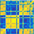
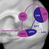
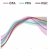
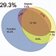
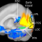
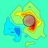
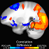

Copyright Notice: These materials are presented to ensure timely dissemination of scholarly and technical work. Copyright and all rights are retained by authors or by other copyright holders.

## Manuscript Preprints
<table style="width:100%">
<tr>
<td style="width:70px"></td>
<td style="width:410px">C. Baldassano, J. Chen, A. Zadbood, J.W. Pillow, U. Hasson, K. Norman. <i>"Discovering event structure in continuous narrative perception and memory."</i> bioRxiv, 2016.
 <a href="http://dx.doi.org/10.1101/081018">[bioRxiv link]</a></td>
</tr>
</table>

## Refereed Publications
<table style="width:100%">
<tr>
<td style="width:410px">C. Baldassano, A. Esteva, L. Fei-Fei, D.M. Beck. <i>"Two distinct scene processing networks connecting vision and memory."</i> eNeuro, 2016.
 <a href="http://dx.doi.org/10.1523/ENEURO.0178-16.2016">[journal link]</a> | <a href="ENEURO.0178-16.2016.full.pdf">[pdf]</a></td>
<td style="width:70px"></td>
</tr>
</table>

<table>
<tr>
<td style="width:70px"></td>
<td style="width:410px">C. Baldassano, L. Fei-Fei, D.M. Beck. <i>"Pinpointing the peripheral bias in neural scene-processing networks during natural viewing."</i> Journal of Vision, 2016.
 <a href="http://jov.arvojournals.org/article.aspx?articleid=2524115">[journal link]</a> | <a href="JOV16.pdf">[pdf]</a> | <a href="JOV16_supp.pdf">[supplementary pdf]</a></td>
</tr>
</table>

<table>
<tr>
<td style="width:410px">C. Baldassano, D.M. Beck, L. Fei-Fei. <i>"Human–Object Interactions Are More than the Sum of Their Parts."</i> Cerebral Cortex, 2016.
 <a href="http://cercor.oxfordjournals.org/cgi/reprint/bhw077?ijkey=iUBNzaBCkEO1hN4&keytype=ref">[free-access journal link]</a> | <a href="CC2016.pdf">[pdf]</a> | <a href="CC2016-supp.pdf">[supplementary pdf]</a></td>
<td style="width:70px"></td>
</tr>
</table>

<table>
<tr>
<td style="width:70px"></td>
<td style="width:410px">M.R. Greene, C. Baldassano, A. Esteva, D.M. Beck, L. Fei-Fei. <i>"Visual scenes are categorized by function."</i> Journal of Experimental Psychology: General, 2016.
 <a href="http://psycnet.apa.org/journals/xge/145/1/82/">[journal link]</a> | <a href="JEPG2016.pdf">[pdf]</a> | <a href="JEPG2016_supplemental.pdf">[supplementary pdf]</a></td>
</tr>
</table>

<table>
<tr>
<td style="width:410px">C. Baldassano, D.M. Beck, L. Fei-Fei. <i>"Parcellating connectivity in spatial maps."</i> PeerJ, 2015.
 <a href="https://peerj.com/articles/784/">[journal link]</a> | <a href="peerj-784.pdf">[pdf]</a> | <a href="peerj-784-supp.pdf">[supplementary pdf]</a></td>
<td style="width:70px"></td>
</tr>
</table>

<table>
<tr>
<td style="width:70px"></td>
<td style="width:410px">C. Baldassano, D.M. Beck, L. Fei-Fei. <i>"Differential Connectivity Within the Parahippocampal Place Area."</i> NeuroImage, 2013.
 <a href="http://www.sciencedirect.com/science/article/pii/S1053811913002280">[journal link]</a> | <a href="NI2013.pdf">[pdf]</a> | <a href="NI_supplemental2013.pdf">[supplementary pdf]</a></td>
</tr>
</table>

<table>
<tr>
<td style="width:410px">C. Baldassano, M.C. Iordan, D.M. Beck, L. Fei-Fei. <i>"Discovering Voxel-Level Functional Connectivity Between Cortical Regions."</i> Machine Learning and Interpretation in NeuroImaging Workshop, NIPS 2012.
 <a href="workshop2012.pdf">[pdf]</a></td>
<td style="width:70px"></td>
</tr>
</table>

<table>
<tr>
<td style="width:70px"></td>
<td style="width:410px">C. Baldassano, M.C. Iordan, D.M. Beck, L. Fei-Fei. <i>"Voxel-Level Functional Connectivity using Spatial Regularization."</i> NeuroImage, 2012.
 <a href="http://www.sciencedirect.com/science/article/pii/S1053811912007756">[journal link]</a> | <a href="NI2012.pdf">[pdf]</a> | <a href="NI_supplemental.pdf">[supplementary pdf]</a></td>
</tr>
</table>

## Theses
<table>
<tr>
<td style="width:410px">C. Baldassano. <i>"Visual scene perception in the human brain: connections to memory, categorization, and social cognition."</i> PhD Dissertation.
 <a href="https://stacks.stanford.edu/file/druid:hn881py5906/dissertation_submit-augmented.pdf">[Stanford Library]</a> | <a href="Baldassano_PhD_thesis_2015.pdf">[pdf]</a></td>
<td style="width:70px"></td>
</tr>
</table>