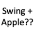
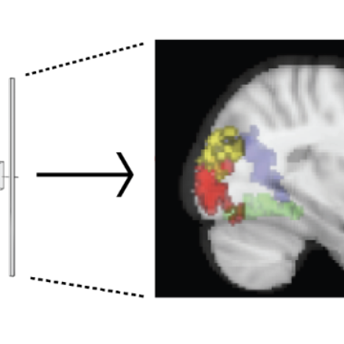
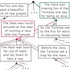
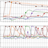

Copyright Notice: These materials are presented to ensure timely dissemination of scholarly and technical work. Copyright and all rights are retained by authors or by other copyright holders.

## Public Preprints
<table>
<tr>
<td style="width:410px">T.A. Chamberlain, D. Shohamy, C. Baldassano. <i>"Prioritizing detailed item memories through post-encoding motivation requires consolidation."</i> PsyArXiv, 2026.
 <a href="https://osf.io/preprints/psyarxiv/7tn9f_v1">[PsyArXiv link]</a>
</td>
<td style="width:70px"></td>
</tr>
</table>

<table>
<tr>
<td style="width:70px"></td>
<td style="width:410px">Z. Hirschstein, M. Aly, C. Baldassano. <i>"Decoupling lower-level and higher-level visual features in naturalistic scenes."</i> PsyArXiv, 2025.
 <a href="https://doi.org/10.31234/osf.io/unv5g_v1">[PsyArXiv link]</a>
</td>
</tr>
</table>

<table>
<tr>
<td style="width:410px">H. Tarder-Stoll, C. Baldassano*, M. Aly*. <i>"The Hippocampus Rapidly Integrates Sequence Representations During Novel Multistep Predictions."</i> bioRxiv, 2025.
 <a href="https://www.biorxiv.org/content/10.1101/2025.09.15.676324v1">[bioRxiv link]</a>
</td>
<td style="width:70px"></td>
</tr>
</table>

<table>
<tr>
<td style="width:70px"></td>
<td style="width:410px">N. Al-Zahli, M. Aly, C. Baldassano. <i>"Repeated Viewing of a Narrative Movie Changes Event Timescales in The Brain."</i> bioRxiv, 2025.
 <a href="https://www.biorxiv.org/content/10.1101/2025.08.27.672403v1">[bioRxiv link]</a>
</td>
</tr>
</table>

<table>
<tr>
<td style="width:410px">J.A. Williams, E.H. Margulis, C. Baldassano, U. Hasson, J. Chen, K.A. Norman. <i>"Music-evoked reactivation during continuous perception is associated with enhanced subsequent recall of naturalistic events."</i> bioRxiv, 2025.
 <a href="https://www.biorxiv.org/content/10.1101/2025.07.05.663273v1">[bioRxiv link]</a>
</td>
 <td style="width:70px"></td>
</tr>
</table>

<table>
<tr>
<td style="width:70px"></td>
<td style="width:410px">B. Silver, C. Baldassano, L. Davachi, K. Ochsner. <i>"The mentalizing network updates neural representations of romantic interest in response to social feedback."</i> OSF, 2025.
 <a href="https://osf.io/preprints/osf/3tc4m_v1">[OSF link]</a>
</td>
</tr>
</table>

<table>
<tr>
<td style="width:410px">Y. Abir, J. Mok, C. Baldassano, C. Marvin, D. Shohamy. <i>"Learning Reinforces Curiosity."</i> PsyArXiv, 2025.
 <a href="https://osf.io/preprints/psyarxiv/9bw6j_v2">[OSF link]</a>
</td>
<td style="width:70px"></td>
</tr>
</table>

<table>
<tr>
<td style="width:70px"></td>
<td style="width:410px">C.S. Lee, S.S. Cohen, S. Hutchinson,  N. Tottenham,  C. Baldassano. <i>"Past and present caregiving experiences impact prefrontal connectivity and recall for attachment-schema narratives."</i> bioRxiv, 2025.
 <a href="https://www.biorxiv.org/content/10.1101/2024.09.13.612953v2">[bioRxiv link]</a>
</td>
</tr>
</table>

<table>
<tr>
<td style="width:410px">J. Huang, A. Manglik, N. Dutra, H. Tarder-Stoll, T. Chamberlain, R. Ajemian, Q. Zhang, K.A. Norman, C. Baldassano. <i>"Binding items to contexts through conjunctive neural representations with the Method of Loci."</i> bioRxiv, 2024.
 <a href="https://doi.org/10.1101/2024.12.19.629352">[bioRxiv link]</a>
</td>
<td style="width:70px"></td>
</tr>
</table>

<table>
<tr>
<td style="width:70px"></td>
<td style="width:410px">S. Shim, F.B. Mugisho, L. Davachi, C. Baldassano. <i>"Generating event boundaries in memory without prediction error."</i> PsyArXiv, 2024.
 <a href="https://osf.io/preprints/psyarxiv/4bdp6">[PsyArXiv link]</a>
</td>
</tr>
</table>

## Journal Publications
<table>
<tr>
<td style="width:70px"></td>
<td style="width:410px">R. Masís-Obando, K.A. Norman, C. Baldassano. <i>"Spatial contexts with reliable neural representations support reinstatement of subsequently placed objects."</i> Nature Human Behaviour, 2026.
 <a href="https://doi.org/10.1038/s41562-025-02379-z">[journal link]</a> | <a href="papers/s41562-025-02379-z.pdf">[pdf]</a>
</td>
</tr>
</table>

<table>
<tr>
<td style="width:410px">M. Nau, A. Greene, H. Tarder-Stoll, J.A. Lossio-Ventura, F. Pereira, J. Chen, C. Baldassano, and C.I. Baker. <i>"Neural and behavioral reinstatement jointly reflect retrieval of narrative events."</i> Nature Communications, 2025.
 <a href="https://doi.org/10.1038/s41467-025-62375-9">[journal link]</a> | <a href="papers/s41467-025-62375-9.pdf">[pdf]</a>
</td>
<td style="width:70px"></td>
</tr>
</table>

<table>
<tr>
<td style="width:70px"></td>
<td style="width:410px">J. Huang, E. Furness, Y. Liu, M.-J. Kenmoe, R. Elias, H.T. Zeng, C. Baldassano. <i>"Accurate predictions facilitate robust memory encoding independently from stimulus probability."</i> Open Mind, 2025.
 <a href="https://doi.org/10.1162/opmi.a.14">[journal link]</a> | <a href="papers/opmi.a.14.pdf">[pdf]</a>
</td>
</tr>
</table>

<table>
<tr>
<td style="width:410px">M.E. Sachs, M.S. Kozak, K.N. Ochsner, C. Baldassano. <i>"Emotions in the brain are dynamic and contextually dependent: using music to measure affective transitions."</i> eNeuro, 2025.
 <a href="https://doi.org/10.1523/ENEURO.0184-24.2025">[journal link]</a> | <a href="papers/ENEURO.0184-24.2025.full.pdf">[pdf]</a>
<td style="width:70px"></td>
</td>
</tr>
</table>

<table>
<tr>
 <td style="width:70px"></td>
<td style="width:410px">M. Silva,  X. Wu,  M. Sabio,  E. Conde-Blanco,  P. Roldan,  A. Donaire, M. Carreno,  N. Axmacher, C. Baldassano,  L. Fuentemilla. <i> "Movie-watching evokes ripple-like activity within events and at event boundaries."</i> Nature Communications, in press.
 <a href="https://doi.org/10.1038/s41467-025-60788-0">[journal link]</a> | <a href="papers/s41467-025-60788-0.pdf">[pdf w/ supplementary]</a>
</td>
</tr>
</table>

<table>
<tr>
<td style="width:410px">C. Durkin, M. Apicella, C. Baldassano, E. Kandel, D. Shohamy. <i>"The Beholder’s Share: Bridging art and neuroscience to study individual differences in subjective experience."</i> PNAS, 2025.
 <a href="https://www.pnas.org/doi/10.1073/pnas.2413871122">[journal link]</a> | <a href="papers/durkin2025.pdf">[pdf w/ supplementary]</a>
</td>
<td style="width:70px"></td>
</tr>
</table>

<table>
<tr>
<td style="width:70px"></td>
<td style="width:410px">H. Tarder-Stoll, C. Baldassano*, M. Aly*. <i>"The brain hierarchically represents the past and future during multistep anticipation."</i> Nature Communications, 2024.
  <a href="https://doi.org/10.1038/s41467-024-53293-3">[journal link]</a> | <a href="papers/s41467-024-53293-3.pdf">[pdf w/ supplementary]</a>
</td>
</tr>
</table>

<table>
<tr>
<td style="width:410px">A. De Soares, T. Kim, F. Mugisho, E. Zhu, A. Lin, C. Zheng,  C. Baldassano. <i> "Top-down attention shifts behavioral and neural event boundaries in narratives with overlapping event scripts."</i> Current Biology, 2024.
  <a href="https://www.doi.org/10.1016/j.cub.2024.09.013">[journal link]</a> | <a href="papers/PIIS0960982224012247.pdf">[pdf w/ supplementary]</a>
  <a href="https://github.com/dpmlab/ScriptPriming">GitHub (code and behavioral data)</a> |
 <a href="https://doi.org/10.18112/openneuro.ds004631.v1.0.0">fMRI data</a> |
 <a href="https://figshare.com/projects/Script_Combination_Stories/168656">Audio stimuli</a>
</td>
<td style="width:70px"></td>
</tr>
</table>

<table>
<tr>
<td style="width:70px"></td>
<td style="width:410px">H. Tarder-Stoll, C. Baldassano*, M. Aly*. <i>"Consolidation enhances multistep anticipatory judgements but diminishes access to perceptual features."</i> Psychological Science, 2024.
  <a href="https://doi.org/10.1177/09567976241256617">[journal link]</a> | <a href="papers/psychsci2024.pdf">[pdf]</a>
</td>
</tr>
</table>

<table>
<tr>
<td style="width:410px">C. Lee, J. Han, M. Feilong, G. Jiahui, J. Haxby, C. Baldassano. <i>"Hyper-HMM: aligning human brains and semantic features in a common latent event space."</i> NeurIPS, 2023.
  <a href="https://openreview.net/forum?id=w6krZiUa7t">[proceedings link]</a> | <a href="papers/8510_hyper_hmm_aligning_human_brain.pdf">[pdf]</a>
</td>
<td style="width:70px"></td>
</tr>
</table>

<table>
<tr>
<td style="width:70px"></td>
<td style="width:410px">M. Bennett, C. Baldassano. <i>"img2fmri: a python package for predicting group-level fMRI responses to visual stimuli using deep neural networks."</i> Aperture Neuro, 2023.
  <a href="https://doi.org/10.52294/001c.87545">[journal link]</a> | <a href="papers/87545-img2fmri.pdf">[pdf]</a> | <a href="https://github.com/dpmlab/imgtofmri">[GitHub link]</a>
</td>
</tr>
</table>

<table>
<tr>
<td style="width:410px">C. Baldassano. <i>"Studying waves of prediction in the brain using narratives."</i> Neuropsychologia, 2023.
 <a href="https://doi.org/10.1016/j.neuropsychologia.2023.108664">[journal link]</a> | <a href="papers/1-s2.0-S0028393223001987-main.pdf">[pdf]</a>
</td>
<td style="width:70px"></td>
</tr>
</table>

<table>
<tr>
 <td style="width:70px"></td>
<td style="width:410px">T. Golan*, M. Siegelman*, N. Kriegeskorte, C. Baldassano. <i>"Testing the limits of natural language models for predicting human language judgments."</i> Nature Machine Intelligence, 2023.
 <a href="https://www.nature.com/articles/s42256-023-00718-1">[journal link]</a> | <a href="papers/s42256-023-00718-1.pdf">[pdf]</a>
</td>
</tr>
</table>

<table>
<tr>
<td style="width:410px">J. Huang, I. Velarde, W.J. Ma, C. Baldassano. <i>"Schema-based predictive eye movements support sequential memory encoding."</i> eLife, 2023.
 <a href="https://doi.org/10.7554/eLife.82599">[journal link]</a> | <a href="papers/elife-82599-v2.pdf">[pdf]</a>
</td>
  <td style="width:70px"></td>
</tr>
</table>

<table>
<tr>
<td style="width:70px"></td>
<td style="width:410px">T.S. Yates, L.J. Skalaban, C.T. Ellis, A.J. Bracher, C. Baldassano, N.B. Turk-Browne. <i>"Neural event segmentation of continuous experience in human infants."</i> PNAS, 2022.
 <a href="https://doi.org/10.1073/pnas.2200257119">[journal link]</a> | <a href="papers/pnas.2200257119.pdf">[pdf]</a>
</td>
</tr>
</table>

<table>
<tr>
<td style="width:410px">S.S. Cohen, N. Tottenham, C. Baldassano. <i>"Developmental changes in story-evoked responses in the neocortex and hippocampus."</i> eLife, 2022.
 <a href="https://doi.org/10.7554/eLife.69430">[journal link]</a> | <a href="papers/elife-69430-v2.pdf">[pdf]</a>
</td>
<td style="width:70px"></td>
</tr>
</table>

<table>
<tr>
<td style="width:70px"></td>
<td style="width:410px">R. Masís-Obando, K.A. Norman, C. Baldassano. <i>"Schema representations in distinct brain networks support narrative memory during encoding and retrieval."</i> eLife, 2022.
 <a href="https://doi.org/10.7554/eLife.70445">[journal link]</a> | <a href="papers/elife-70445-v1.pdf">[pdf]</a> 
<a href="https://figshare.com/articles/dataset/Recall_Transcripts_for_Event_Schema_Experiment/22114298">Recall transcripts</a>
</td>
</tr>
</table>

<table>
<tr>
<td style="width:410px">J.A. Williams,  E.H. Margulis,  S.A. Nastase,  J. Chen,  U. Hasson,  K.A. Norman,  C. Baldassano. <i>"High-Order Areas and Auditory Cortex Both Represent the High-Level Event Structure of Music."</i> Journal of Cognitive Neuroscience, 2022.
 <a href="https://doi.org/10.1162/jocn_a_01815">[journal link]</a> | <a href="papers/jocn_a_01815.pdf">[pdf]</a>
</td>
<td style="width:70px"></td>
</tr>
</table>

<table>
<tr>
<td style="width:70px"></td>
<td style="width:410px">M. Kumar, M. Anderson, J. Antony, C. Baldassano, P. Brooks, M. Cai, P.-H. Chen, C. Ellis, G. Henselman-Petrusek, D. Huberdeau, J.B. Hutchinson, Y.P. Li, Q. Lu, J. Manning, A.C. Mennen, S. Nastase, H. Richard, A.C. Schapiro, N. Schuck, M. Shvartsman, N. Sundaram, D. Suo, J.S. Turek, V. Vo, G. Wallace, Y. Wang, H. Zhang, X. Zhu, M. Capota, J. Cohen, U. Hasson, K. Li, P.J. Ramadge, N. Turk-Browne, T. Willke, K.A. Norman. <i>"BrainIAK: The Brain Imaging Analysis Kit."</i> Aperture Neuro, 2022.
 <a href="https://apertureneuropub.cloud68.co/articles/42/index.html">[journal link]</a> | <a href="papers/Kumar_BrainIAK_The_Brain_Imaging_Analysis_Kit.pdf">[pdf]</a>
  <a href="https://github.com/brainiak/brainiak-aperture">Companion Notebooks</a>
</td>
</tr>
</table>

<table>
<tr>
<td style="width:410px">A. Wu, S.A. Nastase, C. Baldassano, N.B. Turk-Browne, K.A. Norman, B.E. Engelhardt, J.W. Pillow. <i>"Brain kernel: a new spatial covariance function for fMRI data."</i> NeuroImage, 2021.
 <a href="https://doi.org/10.1016/j.neuroimage.2021.118580">[journal link]</a> | <a href="papers/1-s2.0-S1053811921008533-main.pdf">[pdf]</a>
</td>
 <td style="width:70px"></td>
</tr>
</table>

<table>
<tr>
<td style="width:70px"></td>
<td style="width:410px">S.A. Nastase, Y.-F. Liu, H. Hillman, A. Zadbood, L. Hasenfratz, N. Keshavarzian, J. Chen, C.J. Honey, Y. Yeshurun, M. Regev, M. Nguyen, C.H.C. Chang, C. Baldassano, O. Lositsky, E. Simony, M.A. Chow, Y.C. Leong, P.P. Brooks, E. Micciche, G. Choe, A. Goldstein, T. Vanderwal, Y.O. Halchenko, K.A. Norman, U. Hasson. <i>"Narratives: fMRI data for evaluating models of naturalistic language comprehension."</i> Scientific Data, 2021.
 <a href="https://www.nature.com/articles/s41597-021-01033-3">[journal link]</a> | <a href="papers/s41597-021-01033-3.pdf">[pdf]</a>
</td>
</tr>
</table>

<table>
<tr>
<td style="width:410px">H. Tarder-Stoll, C. Gasser, W. Yu, H.R. Dimsdale-Zucker. <i>"Challenges in Understanding the Role of Reactivation in Modifying Hippocampal Representations."</i> Journal Club commentary for the Journal of Neuroscience, 2021.
 <a href="https://doi.org/10.1523/JNEUROSCI.0334-21.2021">[journal link]</a> | <a href="papers/4750.full.pdf">[pdf]</a>
</td>
<td style="width:70px"></td>
</tr>
</table>

<table>
<tr>
<td style="width:70px"></td>
<td style="width:410px">C.S. Lee, M. Aly, C. Baldassano. <i>"Anticipation of temporally structured events in the brain."</i> eLife, 2021.
 <a href="https://doi.org/10.7554/eLife.64972">[journal link]</a> | <a href="papers/elife-64972-v2.pdf">[pdf w/ figure supplements]</a>
</td>
</tr>
</table>

<table>
<tr>
<td style="width:410px">C. Chen, Q. Lu, A. Beukers, C. Baldassano, K. Norman. <i>"Learning to perform role-filler binding with schematic knowledge."</i> PeerJ, 2021.
 <a href="http://doi.org/10.7717/peerj.11046">[journal link]</a> | <a href="papers/peerj-11046.pdf">[pdf]</a>
</td>
<td style="width:70px"></td>
</tr>
</table>

<table>
<tr>
<td style="width:70px"></td>
<td style="width:410px">C. Ellis, C. Baldassano, A.C. Schapiro, M.B. Cai, J.D. Cohen. <i>"Facilitating open-science with realistic fMRI simulation: validation and application."</i> PeerJ, 2020.
 <a href="https://peerj.com/articles/8564/">[journal link]</a> | <a href="papers/peerj-8564.pdf">[pdf]</a>
</td>
</tr>
</table>
<table>
<tr>
<td style="width:410px">M. Siegelman and C. Baldassano. <i>"Remembering together."</i> News & Views, Nature Human Behaviour, 2019.
 <a href="https://doi.org/10.1038/s41562-019-0789-x">[journal link]</a> | <a href="papers/s41562-019-0789-x.pdf">[pdf]</a></td>
<td style="width:70px"></td>
</tr>
</table>

<table>
<tr>
<td style="width:70px"></td>
<td style="width:410px">M. Silva, C. Baldassano, L. Fuentemilla. <i>"Rapid memory reactivation at movie event boundaries promotes episodic encoding."</i> Journal of Neuroscience, 2019.
 <a href="https://www.jneurosci.org/content/39/43/8538">[journal link]</a> | <a href="papers/8538.full.pdf">[pdf]</a>
</td>
</tr>
</table>

<table>
<tr>
<td style="width:410px">C. Baldassano, U. Hasson, K. Norman. <i>"Representation of real-world event schemas during narrative perception."</i> Journal of Neuroscience, 2018.
 <a href="https://doi.org/10.1523/JNEUROSCI.0251-18.2018">[journal link]</a> | <a href="papers/9689.full.pdf">[pdf]</a>
   <a href="https://figshare.com/articles/Event_Schema_Stimuli/5760306/3">Stimuli</a> | <a href="https://doi.org/10.24433/CO.a27d1d90-d227-4600-b876-051a801c7c20.v3">Code and data capsule</a>
   <a href="http://www.doi.org/10.18112/openneuro.ds001510.v1.0.1">Raw data (Main)</a> | <a href="http://www.doi.org/10.18112/openneuro.ds001511.v1.0.1">Raw data (Control)</a>
</td>
<td style="width:70px"></td>
</tr>
</table>

<table>
<tr>
<td style="width:70px"></td>
<td style="width:410px">I.I.A. Groen, M.R. Greene, C. Baldassano, L. Fei-Fei, L., D.M. Beck, C.I. Baker. <i>"Distinct contributions of functional and deep neural network features to representational similarity of scenes in human brain and behavior."</i> eLife, 2018.
 <a href="https://elifesciences.org/articles/32962">[journal link]</a> | <a href="papers/elife-32962-v2.pdf">[pdf]</a></td>
</tr>
</table>

<table>
<tr>
<td style="width:410px">C. Baldassano, J. Chen, A. Zadbood, J.W. Pillow, U. Hasson, K.A. Norman. <i>"Discovering event structure in continuous narrative perception and memory."</i> Neuron, 2017.
 <a href="https://doi.org/10.1016/j.neuron.2017.06.041">[journal link]</a> | <a href="papers/Neuron17.pdf">[pdf w/ supplementary]</a>
   <a href="https://github.com/IntelPNI/brainiak">Python code</a> | <a href="https://github.com/cbaldassano/Event-Segmentation">MATLAB code</a></td>
<td style="width:70px"></td>
</tr>
</table>

<table>
<tr>
<td style="width:70px"></td>
<td style="width:410px">K. Vodrahalli, P.H. Chen, Y. Liang, C. Baldassano, J. Chen, E. Yong, C. Honey, U. Hasson, P. Ramadge, K.A. Norman, S. Arora. <i>"Mapping Between fMRI Responses to Movies and their Natural Language Annotations."</i> NeuroImage, 2017.
 <a href="http://www.sciencedirect.com/science/article/pii/S1053811917305128">[journal link]</a> | <a href="papers/NeuroImage17.pdf">[pdf]</a></td>
</tr>
</table>

<table>
<tr>
<td style="width:410px">C. Baldassano, A. Esteva, L. Fei-Fei, D.M. Beck. <i>"Two distinct scene processing networks connecting vision and memory."</i> eNeuro, 2016.
 <a href="http://dx.doi.org/10.1523/ENEURO.0178-16.2016">[journal link]</a> | <a href="papers/ENEURO.0178-16.2016.full.pdf">[pdf]</a>
   <a href="resources/twoNetworks.nii.gz">Two-network atlas</a></td>
<td style="width:70px"></td>
</tr>
</table>

<table>
<tr>
<td style="width:70px"></td>
<td style="width:410px">C. Baldassano, L. Fei-Fei, D.M. Beck. <i>"Pinpointing the peripheral bias in neural scene-processing networks during natural viewing."</i> Journal of Vision, 2016.
 <a href="http://jov.arvojournals.org/article.aspx?articleid=2524115">[journal link]</a> | <a href="papers/JOV16.pdf">[pdf]</a> | <a href="papers/JOV16_supp.pdf">[supplementary pdf]</a></td>
</tr>
</table>

<table>
<tr>
<td style="width:410px">C. Baldassano, D.M. Beck, L. Fei-Fei. <i>"Human–Object Interactions Are More than the Sum of Their Parts."</i> Cerebral Cortex, 2016.
 <a href="https://academic.oup.com/cercor/article/27/3/2276/3056311/Human-Object-Interactions-Are-More-than-the-Sum-of">[journal link]</a> | <a href="papers/CC2016.pdf">[pdf]</a> | <a href="papers/CC2016-supp.pdf">[supplementary pdf]</a>
    <a href="https://figshare.com/articles/Human-Object_Stimuli_Experiment_1/5213320">Experiment 1 Stimuli</a> | <a href="https://figshare.com/articles/Human-Object_Stimuli_Experiment_2/5213350">Experiment 2 Stimuli</a>
    <a href="https://openneuro.org/datasets/ds001235/">Experiment 2 raw data</a> | <a href="https://doi.org/10.6084/m9.figshare.6128000.v1">ROI data (Matlab)</a>
    <a href="resources/HumanObjectMaps.zip">Decoding maps</a></td>
<td style="width:70px"></td>
</tr>
</table>

<table>
<tr>
<td style="width:70px"></td>
<td style="width:410px">M.R. Greene, C. Baldassano, A. Esteva, D.M. Beck, L. Fei-Fei. <i>"Visual scenes are categorized by function."</i> Journal of Experimental Psychology: General, 2016.
 <a href="http://psycnet.apa.org/journals/xge/145/1/82/">[journal link]</a> | <a href="papers/JEPG2016.pdf">[pdf]</a> | <a href="papers/JEPG2016_supplemental.pdf">[supplementary pdf]</a></td>
</tr>
</table>

<table>
<tr>
<td style="width:410px">C. Baldassano, D.M. Beck, L. Fei-Fei. <i>"Parcellating connectivity in spatial maps."</i> PeerJ, 2015.
 <a href="https://peerj.com/articles/784/">[journal link]</a> | <a href="papers/peerj-784.pdf">[pdf]</a> | <a href="papers/peerj-784-supp.pdf">[supplementary pdf]</a>
    <a href="https://github.com/cbaldassano/Parcellating-connectivity/tree/release">MATLAB and python code</a>
    <a href="resources/Atlas172.dscalar.nii">Surface atlas (CIFTI-2)</a> | <a href="resources/Atlas172.nii">Volumetric atlas</a> | <a href="resources/Atlas172_PPA.nii">Volumetric atlas (PPA only)</a>
</td>
<td style="width:70px"></td>
</tr>
</table>

<table>
<tr>
<td style="width:70px"></td>
<td style="width:410px">C. Baldassano, D.M. Beck, L. Fei-Fei. <i>"Differential Connectivity Within the Parahippocampal Place Area."</i> NeuroImage, 2013.
 <a href="http://www.sciencedirect.com/science/article/pii/S1053811913002280">[journal link]</a> | <a href="papers/NI2013.pdf">[pdf]</a> | <a href="papers/NI_supplemental2013.pdf">[supplementary pdf]</a></td>
</tr>
</table>

<table>
<tr>
<td style="width:410px">C. Baldassano, M.C. Iordan, D.M. Beck, L. Fei-Fei. <i>"Discovering Voxel-Level Functional Connectivity Between Cortical Regions."</i> Machine Learning and Interpretation in NeuroImaging Workshop, NIPS 2012.
 <a href="papers/workshop2012.pdf">[pdf]</a></td>
<td style="width:70px"></td>
</tr>
</table>

<table>
<tr>
<td style="width:70px"></td>
<td style="width:410px">C. Baldassano, M.C. Iordan, D.M. Beck, L. Fei-Fei. <i>"Voxel-Level Functional Connectivity using Spatial Regularization."</i> NeuroImage, 2012.
 <a href="http://www.sciencedirect.com/science/article/pii/S1053811912007756">[journal link]</a> | <a href="papers/NI2012.pdf">[pdf]</a> | <a href="papers/NI_supplemental.pdf">[supplementary pdf]</a>
   <a href="https://github.com/cbaldassano/Voxel-Level-Functional-Connectivity">MATLAB code</a></td>
</tr>
</table>

## Theses
<table>
<tr>
<td style="width:410px">A. Cunningham. <i>"Why Do We Read? Effects of Narrative Tension on Epistemic Curiosity and Information-Seeking Behavior."</i> Undergraduate Senior Thesis. 2025.
 <a href="papers/Thesis_Cunningham.pdf">[pdf]</a></td>
</tr>

<tr>
<td style="width:410px">P.Tham. <i>"Hyper-HMM: A novel computational neuroscientific approach in studying neuroplasticity."</i> Undergraduate Senior Thesis. 2025.
 <a href="papers/Thesis_Tham.pdf">[pdf]</a></td>
</tr>

<tr>
<td style="width:410px">J. Kim. <i>"Human Misidentification of Artificial Agents in Computer-Mediated Communication."</i> Undergraduate Senior Thesis. 2025.
 <a href="papers/Thesis_Kim.pdf">[pdf]</a></td>
</tr>

<tr>
<td style="width:410px">H.T. Zeng. <i>"A Novel Board Game Paradigm for Studying the Acquisition of Overlapping Schemas."</i> Undergraduate Senior Thesis. 2024.
 <a href="papers/Zeng_TX_Thesis.pdf">[pdf]</a></td>
</tr>

<tr>
<td style="width:410px">Y. Liu. <i>"The Effect of Agency on Memory Performance in Multi-step Sequential Plan-making Using Turn-based Strategy Video Board Game."</i> Undergraduate Senior Thesis. 2024.
 <a href="papers/Yifang_Thesis.pdf">[pdf]</a></td>
</tr>

<tr>
<td style="width:410px">M. Siegelman. <i>"Generating structured stimuli for investigations of human behavior and brain activity with computational models."</i> PhD Dissertation. 2024.
 <a href="https://doi.org/10.7916/vbtm-gz89">[Columbia Library]</a> | <a href="papers/Siegelman_columbia_0054D_18232.pdf">[pdf]</a></td>
</tr>

<tr>
<td style="width:410px">H. Tarder-Stoll. <i>"Flexible representations of temporal structure guide multistep prediction."</i> PhD Dissertation. 2023.
 <a href="https://doi.org/10.7916/4eem-re84">[Columbia Library]</a> | <a href="papers/TarderStoll_columbia_0054D_18050.pdf">[pdf]</a></td>
</tr>

<tr>
<td style="width:410px">G. Charite. <i>"Relaxing Breaks in Online University Lectures May Improve Learning Outcomes."</i> Undergraduate Senior Thesis. 2023.
 <a href="papers/Gloria_Thesis.pdf">[pdf]</a></td>
</tr>

<tr>
<td style="width:410px">K. Feng. <i>"Rewriting Memory Lane: Investigating the Effect of Script Retraining on Memory Recall."</i> Undergraduate Senior Thesis. 2023.
 <a href="papers/Karina_Thesis.pdf">[pdf]</a></td>
</tr>

<tr>
<td style="width:410px">S. Hutchinson. <i>"Classifying Online Misinformation with Cognitively-Informed Features from Transformer Language Models."</i> Undergraduate Senior Thesis. 2023.
 <a href="papers/Hutchinson_Thesis.pdf">[pdf]</a></td>
</tr>

<tr>
<td style="width:410px">M.C. Keller. <i>"How can we effectively reinstate narrative memory?."</i> Undergraduate Senior Thesis. 2022.
 <a href="papers/Mareike_Thesis.pdf">[pdf]</a></td>
</tr>

<tr>
<td style="width:410px">S. Shim. <i>"Event Segmentation from Working Memory Load Manipulation."</i> Undergraduate Senior Thesis. 2021.
 <a href="papers/Sunjae_Thesis.pdf">[pdf]</a></td>
</tr>

<tr>
<td style="width:410px">C. Baldassano. <i>"Visual scene perception in the human brain: connections to memory, categorization, and social cognition."</i> PhD Dissertation. 2015.
 <a href="https://stacks.stanford.edu/file/druid:hn881py5906/dissertation_submit-augmented.pdf">[Stanford Library]</a> | <a href="papers/Baldassano_PhD_thesis_2015.pdf">[pdf]</a></td>
</tr>
</table>
