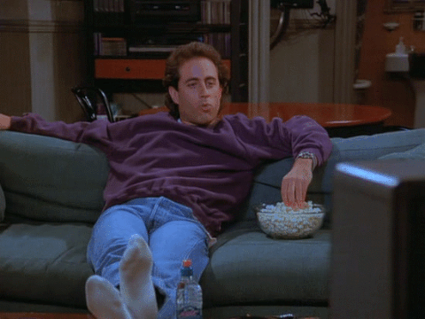
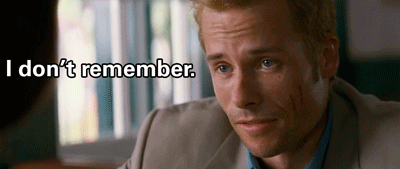

## Perception of movies and stories

Neuroscience research on perception typically focuses on how individual objects or words are represented and understood in the brain. But to understand a full story (whether written, spoken, or filmed) requires keeping track of many pieces of information over time, and integrating them into a coherent narrative. We study how the brain activates event templates  ("schemas") to help organize information, and how information is accumulated over time into discrete event representations.

* * *

## Remembering realistic events

Are the events of our lives recorded continuously into long-term memory, like a DVR? Or are they stored as individual "packets"? How do we reconstruct our past experiences using this stored information? Can we predict which events will be remembered or forgotten? We study these questions by measuring people's brain activy while they recall realistic events from stories or from their lives.

* * *

## Analysis tools for neuroimaging

Answering questions like the ones above will require new approaches to measure brain dynamics during perception and recall, and connect them to high-level stimulus properties. We are developing new tools to identify how events are constructed and reconstructed, both across time and across spatial locations in the brain. All of these tools are publicly available and open source (primarily in python).
